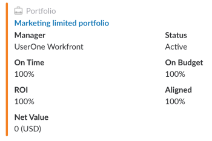
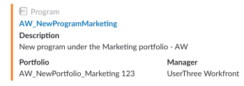
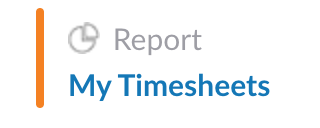

# Access *Adobe Workfront* objects from a shared link in Slack

When links to *Adobe Workfront* objects are shared with you in a Slack channel, you can view additional information about them in Slack, after you have installed and configured *Workfront* for Slack.

For more information about configuring *Workfront* with Slack, see [Configure Adobe Workfront for Slack](../../workfront-integrations-and-apps/using-workfront-with-slack/configure-workfront-for-slack.md).

You must be logged in to *Workfront* in a separate browser tab to open the link or to perform additional actions on those objects from Slack.&nbsp;

When a user is sharing a link to an object in *Workfront* with you, additional information about the object might also be displayed along with the link. The user sending the link must have at least View permissions to the object in order for the additional information to display in Slack.&nbsp;

## Access requirements

You must have the following access to use the functionality described in this article:

<table cellspacing="0"> 
 <col> 
 <col> 
 <tbody> 
  <tr> 
   <td role="rowheader"><em>Adobe Workfront</em> plan*</td> 
   <td> 
Pro or higher
 </td> 
  </tr> 
  <tr> 
   <td role="rowheader"><em>Adobe Workfront</em> license*</td> 
   <td> 
Plan
 </td> 
  </tr> <draft-comment>
   <tr data-mc-conditions="QuicksilverOrClassic.Draft mode"> 
    <td role="rowheader">Access level configurations*</td> 
    <td> 
[Insert any access level configurations needed] <draft-comment>
       <MadCap:conditionalText data-mc-conditions="QuicksilverOrClassic.Draft mode">
        Example: Edit access to Documents
       </MadCap:conditionalText>
      </draft-comment><MadCap:conditionalText data-mc-conditions="QuicksilverOrClassic.Draft mode">
       Example: Edit access to Documents
      </MadCap:conditionalText>
 
Note: If you still don't have access, ask your <em>Workfront administrator</em> if they set additional restrictions in your access level. For information on how a <em>Workfront administrator</em> can modify your access level, see <a href="../../administration-and-setup/add-users/configure-and-grant-access/create-modify-access-levels.md" class="MCXref xref">Create or modify custom access levels</a>.
 <draft-comment>
      
You must be a <em>Workfront administrator</em>. For information on <em>Workfront administrators</em>, see <a href="../../administration-and-setup/add-users/configure-and-grant-access/grant-a-user-full-administrative-access.md" class="MCXref xref">Grant a user full administrative access</a>.

     </draft-comment>
You must be a <em>Workfront administrator</em>. For information on <em>Workfront administrators</em>, see <a href="../../administration-and-setup/add-users/configure-and-grant-access/grant-a-user-full-administrative-access.md" class="MCXref xref">Grant a user full administrative access</a>.
 <draft-comment>
      
You must be a <em>group administrator</em>. For more information on <em>group administrators</em>, see <a href="../../administration-and-setup/manage-groups/group-roles/group-administrators.md" class="MCXref xref">Group administrators</a>.

     </draft-comment>
You must be a <em>group administrator</em>. For more information on <em>group administrators</em>, see <a href="../../administration-and-setup/manage-groups/group-roles/group-administrators.md" class="MCXref xref">Group administrators</a>.
 </td> 
   </tr>
  </draft-comment>
  <tr data-mc-conditions="QuicksilverOrClassic.Draft mode"> 
   <td role="rowheader">Access level configurations*</td> 
   <td> 
[Insert any access level configurations needed] <MadCap:conditionalText data-mc-conditions="QuicksilverOrClassic.Draft mode">
      Example: Edit access to Documents
     </MadCap:conditionalText>
 
Note: If you still don't have access, ask your <em>Workfront administrator</em> if they set additional restrictions in your access level. For information on how a <em>Workfront administrator</em> can modify your access level, see <a href="../../administration-and-setup/add-users/configure-and-grant-access/create-modify-access-levels.md" class="MCXref xref">Create or modify custom access levels</a>.
 
You must be a <em>Workfront administrator</em>. For information on <em>Workfront administrators</em>, see <a href="../../administration-and-setup/add-users/configure-and-grant-access/grant-a-user-full-administrative-access.md" class="MCXref xref">Grant a user full administrative access</a>.
 
You must be a <em>group administrator</em>. For more information on <em>group administrators</em>, see <a href="../../administration-and-setup/manage-groups/group-roles/group-administrators.md" class="MCXref xref">Group administrators</a>.
 </td> 
  </tr> <draft-comment>
   <tr data-mc-conditions="QuicksilverOrClassic.Draft mode"> 
    <td role="rowheader">Object permissions</td> 
    <td> 
[Insert permissions needed and specify the object] <draft-comment>
       <MadCap:conditionalText data-mc-conditions="QuicksilverOrClassic.Draft mode">
        Example: View access or higher on Documents
       </MadCap:conditionalText>
      </draft-comment><MadCap:conditionalText data-mc-conditions="QuicksilverOrClassic.Draft mode">
       Example: View access or higher on Documents
      </MadCap:conditionalText>
 
For information on requesting additional access, see <a href="../../workfront-basics/grant-and-request-access-to-objects/request-access.md" class="MCXref xref">Request access to objects in Adobe Workfront</a>.
 </td> 
   </tr>
  </draft-comment>
  <tr data-mc-conditions="QuicksilverOrClassic.Draft mode"> 
   <td role="rowheader">Object permissions</td> 
   <td> 
[Insert permissions needed and specify the object] <MadCap:conditionalText data-mc-conditions="QuicksilverOrClassic.Draft mode">
      Example: View access or higher on Documents
     </MadCap:conditionalText>
 
For information on requesting additional access, see <a href="../../workfront-basics/grant-and-request-access-to-objects/request-access.md" class="MCXref xref">Request access to objects in Adobe Workfront</a>.
 </td> 
  </tr> 
 </tbody> 
</table>

&#42;To find out what plan, license type, or access you have, contact your *Workfront administrator*.

## Prerequisites

Before you can access your favorites and recent items from Slack, you must

* Configure *Workfront* for Slack  
  For instructions on configuring *Workfront* for Slack, see [Configure Adobe Workfront for Slack](../../workfront-integrations-and-apps/using-workfront-with-slack/configure-workfront-for-slack.md).

## Access projects from Slack

<ol> 
 <li value="1"> 
 Log in to your Slack instance and log in to <em>Workfront</em> from Slack. 
 
For more information about logging in to <em>Workfront</em> from Slack, see the "Logging In to <em>Workfront</em> from Slack" section in <a href="../../workfront-integrations-and-apps/using-workfront-with-slack/access-workfront-from-slack.md" class="MCXref xref">Access Adobe Workfront from Slack</a>.
 </li> 
 <li value="2"> 
Navigate to a message that includes a link to a <em>Workfront</em> project.
 <note type="note">
   The user who is sharing the link must have at least View permissions to the project in order for you to see additional information about it.
  </note> 
    
 </li> 
 <li value="3">(Optional) Click the name of the project to open it in <em>Workfront</em> in a new browser tab.&nbsp;</li> 
 <li value="4"> Consider reviewing the&nbsp;following additional information about the project:&nbsp; 
  <ul>
   <li>Status: For more information about project status, see <a href="../../administration-and-setup/customize-workfront/creating-custom-status-and-priority-labels/project-statuses.md" class="MCXref xref">Access the list of system project statuses</a>.</li>
   <li>Planned Completion Date: For more information about the Planned Completion Date, see <a href="../../manage-work/projects/planning-a-project/project-planned-completion-date.md" class="MCXref xref">Set the project Planned Completion Date</a>.</li>
   <li>Portfolio Name: For more information about portfolios, see <a href="../../manage-work/portfolios/portfolios-overview/portfolio-overview.md" class="MCXref xref">Portfolio overview in Adobe Workfront</a>.</li>
   <li>Condition: For more information about Project Condition, see <a href="../../manage-work/projects/manage-projects/project-condition-and-condition-type.md" class="MCXref xref">Overview of Project Condition and Condition Type</a>.</li>
   <li>Percent Complete: For more information about the Percent Complete value of a project, see <a href="../../manage-work/tasks/task-information/project-percent-complete.md" class="MCXref xref">Project Percent Complete overview</a>.</li>
   <li>Reference Number: For more information about object reference numbers, see <a href="../../workfront-basics/navigate-workfront/search/reference-number-of-objects.md" class="MCXref xref">Use the reference number of objects</a>.</li>
  </ul></li> 
 <li value="5"> 
(Optional) Click Subscribe to subscribe to the project. 
 
You receive a confirmation that you have successfully subscribed to the project.
 </li> 
</ol>

## Access tasks from Slack

<ol> 
 <li value="1"> 
 Log in to your Slack instance and log in to <em>Workfront</em> from Slack. 
 
For more information about logging in to <em>Workfront</em> from Slack, see the "Logging In to <em>Workfront</em> from Slack" section in <a href="../../workfront-integrations-and-apps/using-workfront-with-slack/access-workfront-from-slack.md" class="MCXref xref">Access Adobe Workfront from Slack</a>.
 </li> 
 <li value="2"> 
 Navigate to a message that includes a link to a <em>Workfront</em> task.
 <note type="note">
   The user who is sharing the link must have at least View permissions to the task in order for you to see additional information about it.
    
  </note> </li> 
 <li value="3">(Optional) Click the name of the task to open it in <em>Workfront</em> in a new browser tab.&nbsp;</li> 
 <li value="4"> Consider reviewing the&nbsp;following additional information about the task: 
  <ul>
   <li>
Status 

For more information about task statuses, see <a href="../../administration-and-setup/customize-workfront/creating-custom-status-and-priority-labels/task-statuses.md" class="MCXref xref">Access the list of system task statuses</a>.
</li>
   <li>Percent Complete</li>
   <li>Assigned To Name </li>
   <li>Planned Completion Date </li>
   <li>Project Name or Parent Task Name </li>
   <li>
Reference Number 

For more information about object reference numbers, see <a href="../../workfront-basics/navigate-workfront/search/reference-number-of-objects.md" class="MCXref xref">Use the reference number of objects</a>.
</li>
  </ul></li> 
 <li value="5"> 
(Optional) Click Subscribe to subscribe to the task. 
 
You receive a confirmation that you have successfully subscribed to the task.
 </li> 
 <li value="6">(Optional) Click Assign to user to assign the task to a user.</li> 
 <li value="7"> 
(Conditional) Start typing the name of a user, if you have clicked Assign to user. 
 
You cannot assign a task to a job role or a team&nbsp;from Slack.
 </li> 
</ol>

## Access issues from Slack

<ol> 
 <li value="1"> 
 Log in to your Slack instance and log in to <em>Workfront</em> from Slack. 
 
For more information about logging in to <em>Workfront</em> from Slack, see the "Logging In to <em>Workfront</em> from Slack" section in <a href="../../workfront-integrations-and-apps/using-workfront-with-slack/access-workfront-from-slack.md" class="MCXref xref">Access Adobe Workfront from Slack</a>.
 </li> 
 <li value="2"> 
 Navigate to a message that includes a link to a <em>Workfront</em> issue.
 <note type="note">
   The user who is sharing the link must have at least View permissions to the issue in order for you to see additional information about it.
    
  </note> </li> 
 <li value="3">(Optional) Click the name of the issue to open it in <em>Workfront</em> in a new browser tab.&nbsp;</li> 
 <li value="4"> Consider reviewing the&nbsp;following additional information about the task: 
  <ul>
   <li>Status: For more information about task statuses, see <a href="../../administration-and-setup/customize-workfront/creating-custom-status-and-priority-labels/issue-statuses.md" class="MCXref xref">Access the list of system issue statuses</a>.</li>
   <li>Assigned To Name </li>
   <li>Planned Completion Date </li>
   <li>Project Name </li>
   <li>Reference Number: For more information about object reference numbers, see <a href="../../workfront-basics/navigate-workfront/search/reference-number-of-objects.md" class="MCXref xref">Use the reference number of objects</a>.</li>
  </ul></li> 
 <li value="5"> 
(Optional) Click Subscribe to subscribe to the issue. 
 
You receive a confirmation that you have successfully subscribed to the issue.
 </li> 
 <li value="6">(Optional) Click Assign to user to assign the issue to a user.</li> 
 <li value="7"> 
(Conditional) Start typing the name of a user, if you have clicked Assign to user. 
 
You cannot assign an issue to a job role or a team&nbsp;from Slack.
 </li> 
</ol>

## Access portfolios from Slack

<ol> 
 <li value="1"> 
 Log in to your Slack instance and log in to <em>Workfront</em> from Slack. 
 
For more information about logging in to <em>Workfront</em> from Slack, see the "Logging In to <em>Workfront</em> from Slack" section in <a href="../../workfront-integrations-and-apps/using-workfront-with-slack/access-workfront-from-slack.md" class="MCXref xref">Access Adobe Workfront from Slack</a>.
 </li> 
 <li value="2"> 
Navigate to a message that includes a link to a <em>Workfront</em> portfolio.
 <note type="note">
   The user who is sharing the link must have at least View permissions to the portfolio in order for you to see additional information about it.
  </note> 
 <draft-comment>
    
   </draft-comment>   
 </li> 
 <li value="3">(Optional) Click the name of the portfolio to open it in <em>Workfront</em> in a new browser tab.&nbsp;</li> 
 <li value="4"> Consider reviewing the&nbsp;following additional information about the portfolio: 
  <ul>
   <li>Portfolio Manager Name</li>
   <li>On Time</li>
   <li>ROI</li>
   <li>Net Value</li>
   <li>Status</li>
   <li>On Budget</li>
   <li>
Aligned 

For more information about portfolio metrics, including ROI, Net Value, Alignment, and On Time and On Budget values, see <a href="../../manage-work/portfolios/portfolio-optimizer/portfolio-optimizer-overview.md">Understanding the Portfolio Optimizer.</a>
</li>
  </ul></li> 
</ol>

## Access programs from Slack

<ol> 
 <li value="1"> 
 Log in to your Slack instance and log in to <em>Workfront</em> from Slack. 
 
For more information about logging in to <em>Workfront</em> from Slack, see the "Logging In to <em>Workfront</em> from Slack" section in <a href="../../workfront-integrations-and-apps/using-workfront-with-slack/access-workfront-from-slack.md" class="MCXref xref">Access Adobe Workfront from Slack</a>.
 </li> 
 <li value="2"> 
Navigate to a message that includes a link to a <em>Workfront</em> program.
 <note type="note">
   &nbsp;The user who is sharing the link must have at least View permissions to the program in order for you to see additional information about it.
  </note> 
 <draft-comment>
    
   </draft-comment>   
 </li> 
 <li value="3">(Optional) Click the name of the program to open it in <em>Workfront</em> in a new browser tab.&nbsp;</li> 
 <li value="4"> Consider reviewing the&nbsp;following additional information about the program: 
  <ul>
   <li>Description</li>
   <li>Portfolio Name</li>
   <li>
Program Manager Name 

For more information about programs, see <a href="../../manage-work/portfolios/create-and-manage-programs/create-and-manage-programs.md">Create and manage Programs.</a>
</li>
  </ul></li> 
</ol>

## Access reports from Slack

<ol> 
 <li value="1"> 
 Log in to your Slack instance and log in to <em>Workfront</em> from Slack. 
 
For more information about logging in to <em>Workfront</em> from Slack, see the "Logging In to <em>Workfront</em> from Slack" section in <a href="../../workfront-integrations-and-apps/using-workfront-with-slack/access-workfront-from-slack.md" class="MCXref xref">Access Adobe Workfront from Slack</a>.
 </li> 
 <li value="2"> 
Navigate to a message that includes a link to a <em>Workfront</em> report.
 <note type="note">
   The user who is sharing the link must have at least View permissions to the report in order for you to see additional information about it.
  </note> <draft-comment>
   
 <draft-comment>
     
    </draft-comment>   

  </draft-comment>
    
 </li> 
 <li value="3">(Optional) Click the name of the report to open it in <em>Workfront</em> in a new browser tab.&nbsp;</li> 
</ol>

