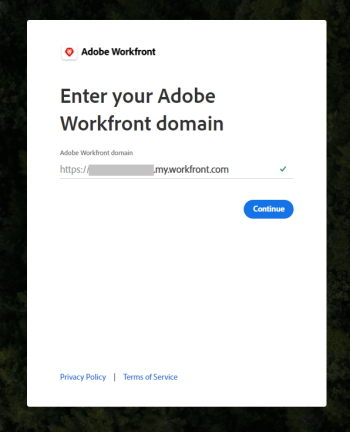
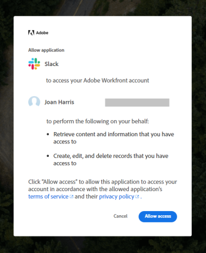

# Configure `Adobe Workfront` for Slack

Integrating `Adobe Workfront` with Slack allows you to do the following:

* Access your `Workfront` work items, approvals, favorites, recent items from Slack. 
* Subscribe for, approve, assign work from Slack. 
* Create tasks and issues from Slack. 
* Receive some `Workfront` notifications in Slack.

Depending on how your Slack environment is configured, you can install and configure `Workfront` for Slack yourself, or your `Workfront administrator` must install and configure it first before you can configure it for yourself.&nbsp;

When you integrate your Slack instance with `Workfront` users can use `Workfront` while collaborating within their Slack channels. The integration can be used from any Slack environment, including the Slack mobile app.&nbsp;

## Access requirements

You must have the following:

<table cellspacing="0"> 
 <col> 
 </col> 
 <col> 
 </col> 
 <tbody> 
  <tr> 
   <td role="rowheader"><a href="https://www.workfront.com/plans" target="_blank">Adobe Workfront plan</a>*</td> 
   <td> 
Pro or higher
 </td> 
  </tr> <!--
   Adobe Workfront licenses overview* Plan
  --> 
 </tbody> 
</table>

&#42;To find out what plan, license type, or access you have, contact your `Workfront administrator`.\

## Prerequisites for using `Workfront` with Slack

<ul> 
 <li> You must have a Slack instance.&nbsp; </li> 
 <li> Your Slack system administrator must allow all Slack users to install Workfront for Slack. </li> 
 <li> 
You must have a Workfrontlicense to be able to use the integrated features in Workfront.
 <note type="note">
   Users with any 
   Workfrontlicense type can access 
   Workfrontfrom Slack. The actions that you can perform from Slack are limited to your 
   Workfrontlicense and permission levels.
  </note> </li> 
</ul>

For more information about managing apps in Slack, see [Manage Apps for Your Workspace.](https://get.slack.help/hc/en-us/articles/222386767-Manage-apps-for-your-workspace)

## Install `Workfront` for Slack

Each Slack user must install the `Workfront` app themselves in order to use `Workfront` from Slack.

You can install the app in the following ways:

* [Install the Workfront app outside Slack](#installing-the-workfront-addin-outside-of-the-slack-application) 
* [Install the Workfront app within Slack](#installing-the-workfront-addin-within-the-slack-application)

### Install the `Workfront` app outside Slack

Follow the steps below to run the installation process and authorize `Workfront` for Slack on your Slack instance.&nbsp;

>[!IMPORTANT]
>
>When a new version of `Workfront` for Slack is released, you must re-authorize the app in order to continue using it.&nbsp;

<ol> 
 <li value="1"> 
 Click the following button to begin the installation process.
 
    
 </li> 
 <li value="2"> Sign in to your workspace by specifying your Slack URL and clicking <b>Continue</b>.  </li> 
 <li value="3"> 
 Examine the access that Slack is requesting. If you agree to this access, click <b>Allow Access</b> to authorize the Workfront app.
 
    
 </li> 
</ol>

You can now access `Workfront` from Slack, as described in the [Access Workfront from Slack](../../workfront-integrations-and-apps/using-workfront-with-slack/access-workfront-from-slack.md#viewing-all-available-commands) section in [Access Adobe Workfront from Slack](../../workfront-integrations-and-apps/using-workfront-with-slack/access-workfront-from-slack.md).

### Install the `Workfront` app within Slack

You can install the `Workfront` app directly from the Slack application:

<ol> 
 <li value="1"> 
Navigate to your Slack URL. 
 
For example: <i><YourTeamName>.slack.com/apps</i>.<a href="http://slack.com/apps" data-saferedirecturl="https://www.google.com/url?hl=en&q=http://slack.com/apps&source=gmail&ust=1506608298853000&usg=AFQjCNGRF_14dK973L5yzpMm0yQPkqzpUg"> </a>Or 
 
Click the Add Apps icon in your Slack instance. 
 
  
 </li> 
 <li value="2">Start typing <em>Workfront</em> in the search field.</li> 
 <li value="3">Press Enter.</li> 
 <li value="4">Select the Workfront app.</li> 
 <li value="5">Click Settings.&nbsp; The App Directory page is displayed.</li> 
 <li value="6">Click Visit App Site.</li> 
 <li value="7">Click Add to Slack.</li> 
 <li value="8">Follow the steps to finish the installation.&nbsp;</li> 
 <li value="9">When the installation completes, you can access Workfront from Slack, as described in the <a href="../../workfront-integrations-and-apps/using-workfront-with-slack/access-workfront-from-slack.md#viewing-all-available-commands" class="MCXref xref">Access Workfront from Slack</a> section in <a href="../../workfront-integrations-and-apps/using-workfront-with-slack/access-workfront-from-slack.md" class="MCXref xref">Access Adobe Workfront from Slack</a>.</li> 
</ol>

