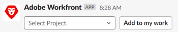

# Create tasks and issues from Slack

After you have installed and configured *Adobe Workfront* for Slack, you can create tasks and issues from Slack and associate them with projects in *Workfront*.

For more information about configuring *Workfront* with Slack, see [Configure Adobe Workfront for Slack](../../workfront-integrations-and-apps/using-workfront-with-slack/configure-workfront-for-slack.md).&nbsp;

You must have access to create tasks and issues in your Access Level and you must have Contribute permissions on the project that you are associating them with.&nbsp;

For more information about Access Levels, see [Access levels overview](../../administration-and-setup/add-users/access-levels-and-object-permissions/access-levels-overview.md). For more&nbsp;information about permissions to objects, see [Overview of sharing permissions on objects in Adobe Workfront](../../workfront-basics/grant-and-request-access-to-objects/sharing-permissions-on-objects-overview.md).

## Access requirements

You must have the following:

<table cellspacing="0"> 
 <col> 
 </col> 
 <col> 
 </col> 
 <tbody> 
  <tr> 
   <td role="rowheader"><a href="https://www.workfront.com/plans" target="_blank"><em>Adobe Workfront</em> plan</a>*</td> 
   <td> 
Pro or higher
 </td> 
  </tr> <draft-comment>
   <tr data-mc-conditions="QuicksilverOrClassic.Draft mode"> 
    <td role="rowheader"><a href="../../administration-and-setup/add-users/access-levels-and-object-permissions/wf-licenses.md" class="MCXref xref">Adobe Workfront licenses overview</a>*</td> 
    <td> 
Plan
 </td> 
   </tr>
  </draft-comment>
  <tr data-mc-conditions="QuicksilverOrClassic.Draft mode"> 
   <td role="rowheader"><a href="../../administration-and-setup/add-users/access-levels-and-object-permissions/wf-licenses.md" class="MCXref xref">Adobe Workfront licenses overview</a>*</td> 
   <td> 
Plan
 </td> 
  </tr> 
 </tbody> 
</table>

&#42;To find out what plan, license type, or access you have, contact your *Workfront administrator*.\

## Prerequisites

Before you can create tasks and issues from Slack, you must

* Configure *Workfront* for Slack  
  For instructions on configuring *Workfront* for Slack, see [Configure Adobe Workfront for Slack](../../workfront-integrations-and-apps/using-workfront-with-slack/configure-workfront-for-slack.md).

## Create tasks from Slack

<ol> 
 <li value="1"> Log in to your Slack instance and log in to <em>Workfront</em> from Slack. For more information about logging in to <em>Workfront</em> from Slack, see the "Logging In to <em>Workfront</em> from Slack" section in <a href="../../workfront-integrations-and-apps/using-workfront-with-slack/access-workfront-from-slack.md" class="MCXref xref">Access Adobe Workfront from Slack</a>.</li> 
 <li value="2"> 
From any channel, start typing the following command in the message field:&nbsp; <em><code>/workfront add task <Task Name></code>.</em>
 <note type="note">
   Commands are case sensitive. You can start your command with 
   <code>/wf</code> instead of /
   <code>workfront</code>.
    The Task Name must be entered as it will appear in the 
   <em>Workfront</em> interface, without brackets or quotation marks.
    
   
    
  </note> </li> 
 <li value="3">(Optional) Start typing the name of a project with which you want to associate the new task and select it when it appears in the list. You receive a confirmation indicating that the task was added to the selected project.</li> 
 <li value="4">(Optional) Click the name of the task in the confirmation message to open it in <em>Workfront</em>, in a new browser tab.</li> 
</ol>

## Create issues from Slack

<ol> 
 <li value="1"> Log in to your Slack instance and log in to <em>Workfront</em> from Slack. For more information about logging in to <em>Workfront</em> from Slack, see the "Logging In to <em>Workfront</em> from Slack" section in <a href="../../workfront-integrations-and-apps/using-workfront-with-slack/access-workfront-from-slack.md" class="MCXref xref">Access Adobe Workfront from Slack</a>.</li> 
 <li value="2"> 
From any channel, start typing the following command in the message field:&nbsp; <code>/workfront add issue <Issue Name></code><em>.</em>
 <note type="note">
   Commands are case sensitive. You can start your command with '/wf' instead of '/workfront.'&nbsp;
    The Issue Name must be entered as it will appear in the 
   <em>Workfront</em> interface, without brackets or quotation marks.
    
   
    
  </note> </li> 
 <li value="3">(Optional) Start typing the name of a project with which you want to associate the new issue and select it when it appears in the list. You receive a confirmation indicating that the issue was added to the selected project.&nbsp;</li> 
 <li value="4">(Optional) Click the name of the issue in the confirmation message to open it in <em>Workfront</em>, in a new browser tab.</li> 
</ol>

