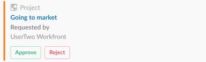
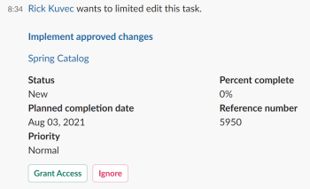
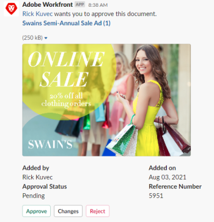

# Manage your work and approvals from Slack

After you have installed *Adobe Workfront* for Slack, you can do the following:

* Access lists of your Home items from Slack
* Review and accept to work on tasks and issues from Slack
* Review and make decisions on approvals from Slack

For more information about configuring *Workfront* with Slack, see [Configure Adobe Workfront for Slack](../../workfront-integrations-and-apps/using-workfront-with-slack/configure-workfront-for-slack.md).

## Access requirements

You must have the following:

<table cellspacing="0"> 
 <col> 
 <col> 
 <tbody> 
  <tr> 
   <td role="rowheader"><a href="https://www.workfront.com/plans" target="_blank"><em>Adobe Workfront</em> plan</a>*</td> 
   <td> 
Pro or higher
 </td> 
  </tr> <draft-comment>
   <tr data-mc-conditions="QuicksilverOrClassic.Draft mode"> 
    <td role="rowheader"><a href="../../administration-and-setup/add-users/access-levels-and-object-permissions/wf-licenses.md" class="MCXref xref">Adobe Workfront licenses overview</a>*</td> 
    <td> 
Plan
 </td> 
   </tr>
  </draft-comment>
  <tr data-mc-conditions="QuicksilverOrClassic.Draft mode"> 
   <td role="rowheader"><a href="../../administration-and-setup/add-users/access-levels-and-object-permissions/wf-licenses.md" class="MCXref xref">Adobe Workfront licenses overview</a>*</td> 
   <td> 
Plan
 </td> 
  </tr> 
 </tbody> 
</table>

&#42;To find out what plan, license type, or access you have, contact your *Workfront administrator*.\

## Prerequisites

Before you can manage your work and approvals from Slack, you must

* Configure *Workfront* for Slack  
  For instructions on configuring *Workfront* for Slack, see [Configure Adobe Workfront for Slack](../../workfront-integrations-and-apps/using-workfront-with-slack/configure-workfront-for-slack.md).

## Manage your work from Slack

<ol> 
 <li value="1"> Log in to your Slack instance and log in to <em>Workfront</em> from Slack. For more information about logging in to <em>Workfront</em> from Slack, see the "Logging In to <em>Workfront</em> from Slack" section in <a href="../../workfront-integrations-and-apps/using-workfront-with-slack/access-workfront-from-slack.md" class="MCXref xref">Access Adobe Workfront from Slack</a>.</li> 
 <li value="2"> 
From any channel, start typing the following command in the message field:&nbsp; <code>/workfront home</code>
 <note type="note"> 
   <ul> 
    <li>Commands are case sensitive. </li> 
    <li>You can start your command with /<code>wf</code> instead of <code>/workfront</code>.</li> 
   </ul> 
  </note> 
The buttons from which you can access lists of your tasks, issues, and approvals display. Clicking one of the buttons displays the first 20 items of each list in Slack. &nbsp; 
 </li> 
 <li value="3"> 
(Optional) Click Tasks&nbsp;to display all your tasks.
 
For more information about managing tasks in Slack, see <a href="#managing-working-on-list">Managing Your Tasks from Slack</a>.
 </li> 
 <li value="4"> 
(Optional) Click Issues to display all your issues.
 
For more information about managing issues in Slack, see <a href="#manahing-work-requests">Managing Your Issues from Slack</a>. 
 </li> 
 <li value="5">(Optional) Click Approvals to display all the approvals waiting for your decision. For more information about managing your approvals in Slack, see <a href="#managing-approvals" class="MCXref xref">Manage your approvals from Slack</a>.</li> 
</ol>

## Manage your tasks from Slack

<ol> 
 <li value="1"> Log in to your Slack instance and log in to <em>Workfront</em> from Slack. For information about logging in to <em>Workfront</em> from Slack, see the "Logging In to <em>Workfront</em> from Slack" section in <a href="../../workfront-integrations-and-apps/using-workfront-with-slack/access-workfront-from-slack.md" class="MCXref xref">Access Adobe Workfront from Slack</a>.</li> 
 <li value="2"> 
From any channel, start typing either of the following commands in the message field:&nbsp; <em><code>/workfront home</code>,&nbsp;</em>then click Tasks
 
Or
 
<code>/workfront tasks</code> 
 <note type="note"> 
   <ul> 
    <li>Commands are case sensitive.</li> 
    <li>You can start your command with '/wf' instead of '/workfront.'</li> 
   </ul> 
  </note> 
The first 20 tasks on your list display. 
 </li> 
 <li value="3"> 
Click +<remaining number> more&nbsp;to display additional tasks.
 </li> 
 <li value="4"> 
Consider reviewing the following information about your work items:
 
  <ul> 
   <li>Name </li> 
   <li>Project Name or Parent Object Name</li> 
   <li>Planned Completion Date of the work item.</li> 
   <li>Assigned By Name: this is the name of the user who assigned the task to you.</li> 
   <li>Status </li> 
  </ul> </li> 
 <li value="5"> 
(Optional) Click the name of an item to open it in <em>Workfront</em> in a separate browser tab.
 </li> 
 <li value="6"> 
(Optional) In the Status field, select a new Status.
 </li> 
 <li value="7"> 
(Optional) Click Log Time, then select an Hour Type and an hour amount to log time on the item.
 <note type="note"> 
   <ul> 
    <li>You can only log hours in increments of a full or half hour, up to 12 hours and 30 minutes.</li> 
    <li>The hours you log have an Entry Date of today. You cannot log time for a passed or future date from Slack.</li> 
   </ul> 
  </note> 
You receive a confirmation that the time has been logged.
 </li> 
 <li value="8"> 
(Optional) Click Work on it to accept to work on a task. The Work on it button disappears.
 </li> 
</ol>

## Manage your issues from Slack

<ol> 
 <li value="1"> Log in to your Slack instance and log in to <em>Workfront</em> from Slack. For more information about logging in to <em>Workfront</em> from Slack, see the <a href="../../workfront-integrations-and-apps/using-workfront-with-slack/access-workfront-from-slack.md#logging-in-to-workfront">Logging In to <em>Workfront</em> from Slack</a> section in <a href="../../workfront-integrations-and-apps/using-workfront-with-slack/access-workfront-from-slack.md" class="MCXref xref">Access Adobe Workfront from Slack</a>.</li> 
 <li value="2">From any channel, start typing either of the following commands in the message field:&nbsp; <em><code>/workfront home</code>,&nbsp;</em>then click Issues  Or <code>/workfront issues</code> <note type="note">
   Commands are case sensitive. You can start your command with 
   <code>/wf</code> instead of 
   <code>/workfront</code>.
    
  </note>The first 20 issues in your list display.  </li> 
 <li value="3">Click + remaining <number> more to display additional items.</li> 
 <li value="4">Consider reviewing the following information about your work items: 
  <ul>
   <li>Name</li>
   <li>Project Name or Parent Object Name</li>
   <li>Due on Date: This is the Planned Completion Date of the work item.</li>
   <li>Requested by Name: This is the Primary Contact (for issues) or the user who made the assignment (for tasks).&nbsp;</li>
  </ul></li> 
 <li value="5">(Optional) Click the name of the issue to open it in <em>Workfront</em> in a separate browser tab.</li> 
 <li value="6"> 
(Optional) Click Work on it to start working on issues you have not accepted yet.
 
The Work on it button disappears.
 </li> 
</ol>

## Manage your approvals from Slack

<ol> 
 <li value="1"> Log in to your Slack instance and log in to <em>Workfront</em> from Slack. For more information about logging in to <em>Workfront</em> from Slack, see the "Logging In to <em>Workfront</em> from Slack" section in <a href="../../workfront-integrations-and-apps/using-workfront-with-slack/access-workfront-from-slack.md" class="MCXref xref">Access Adobe Workfront from Slack</a>.</li> 
 <li value="2"> 
From any channel, start typing either of the following commands in the message field:&nbsp; <em><code>/workfront home</code>,&nbsp;</em>then click Approvals&nbsp; Or <code>/workfront approvals</code>
 <note type="note"> 
   <ul> 
    <li>Commands are case sensitive. </li> 
    <li>You can start your command with <code>/wf</code> instead of <code>/workfront</code>. </li> 
   </ul> 
  </note> 
The first 20 items on your Approvals list display. Additional information about the items also displays, like the name of the user who requested it or the name of the project the item belongs to.&nbsp;
 </li> 
 <li value="3">Click + remaining <number> more to display additional items. <draft-comment>
   
  </draft-comment>  </li> 
 <li value="4">Consider managing approvals for the following objects:&nbsp; 
  <ul>
   <li>Projects Click Approve or Reject to accept or reject the status change of a project.</li>
   <li>Tasks Click Approve or Reject to accept or reject the status change of a task.</li>
   <li>Issues Click Approve or Reject to accept or reject the status change of an issue.</li>
   <li>Documents Click Approve to approve a document, Reject to reject it, or Changes to indicate that you approve it, but that the document needs additional changes. (Optional) Mouse over the document thumbnail to click the magnifying glass and preview the document.&nbsp;</li>
   <li>Proofs Click the <em>proof</em> name to open it in <em>Workfront</em> in a separate tab and manage the approval.&nbsp;</li>
   <li>Access Requests Click Grant Access to give enhanced permissions to the requested object, or Ignore to ignore the request for more access.</li>
  </ul></li> 
 <li value="5">(Optional) Click the name of the object submitted for approval to open it in <em>Workfront</em> in a new browser tab.&nbsp;</li> 
</ol>

