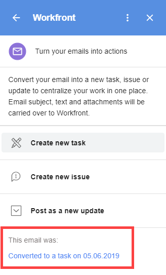

# Create a Adobe Workfront issue in G Suite using email content

You can convert an external email (not generated by Adobe Workfront) to a Workfront issue.

You can also convert an external email to an update on an existing issue. For more information, see [Update a Adobe Workfront item from G Suite using email content](../../workfront-integrations-and-apps/workfront-for-g-suite/update-wf-item-using-email-content.md).

For information about using G Suite to work with notification emails sent by Workfront, see [Manage Adobe Workfront notification details from G Suite](../../workfront-integrations-and-apps/workfront-for-g-suite/manage-wf-email-notification-details-in-gsuite.md).

## Access requirements

You must have the following access to perform the steps in this article:

<table cellspacing="0"> 
 <col> 
 <col> 
 <tbody> 
  <tr> 
   <td role="rowheader">Adobe Workfront plan*</td> 
   <td> 
Any
 </td> 
  </tr> 
  <tr> 
   <td role="rowheader">Adobe Workfront license*</td> 
   <td> 
Work, Plan
 </td> 
  </tr> <!--
   Access level configurations* [Insert any access level configurations needed] Example: Edit access to Documents Note: If you still don't have access, ask your Workfront administrator if they set additional restrictions in your access level. For information on how a Workfront administrator can modify your access level, see Create or modify custom access levels. You must be a Workfront administrator. For information on Workfront administrators, see Grant a user full administrative access. You must be a group administrator. For more information on group administrators, see Group administrators.
  --> <!--
   Object permissions [Insert permissions needed and specify the object] Example: View access or higher on Documents For information on requesting additional access, see Request access to objects in Adobe Workfront.
  --> 
 </tbody> 
</table>

&#42;To find out what plan, license type, or access you have, contact your Workfront administrator.

## Prerequisites

Before you can create an issue from G Suite, you must

* Install Workfront for G suite  
  For instructions, see [Install Adobe Workfront for G Suite](../../workfront-integrations-and-apps/workfront-for-g-suite/install-workfront-for-gsuite.md).

## Create a Adobe Workfront issue in G Suite using email content

<ol> 
 <li value="1">If the Workfront for G Suite panel is not displayed, click the&nbsp;Workfront icon  in the G Suite add-ons sidebar at the far-right of the page. </li> 
 <li value="2"> 
With the email message open in G Suite, click an option in Workfront for G Suite to convert the email to a new Workfront issue.
 
  
 </li> 
 <li value="3"> 
If you want to attach the issue to a parent project, click Project name, start typing the name of the project where you want the issue, then click the project name when it appears in the list below.
 </li> 
 <li value="4"> 
Make any of these changes:
 
  <table cellspacing="0"> 
   <col> 
   <col> 
   <tbody> 
    <tr> 
     <td role="rowheader">Issue Name</td> 
     <td>Edit any part of this text, which is taken from the email's subject line.</td> 
    </tr> 
    <tr> 
     <td role="rowheader">Description</td> 
     <td>Edit any part of this text, which is taken from the body of the email.</td> 
    </tr> Assign To Click Assign To, click the Assign this to option that appears, then start typing the person's name and click it when it appears in the list below. Repeat this for each person you want to add, then click Save. Priority Click the drop-down arrow, then click the priority you want for the issue. Include email attachments (Available only if the email contains at least one attachment.) Click this option to save attachments in the email to the Documents area of the issue. If you do not want to save an attachment, click the X to the right of its name. If the email contains links to documents in Google Drive, they are saved to the Overview tab of the issue you are creating. Important: In order for this to work, your Workfront administrator must authorize Google Drive to work with documents in Workfront. , as described in the section Configure integrations to manage documents in the article Configure document integrations. If you enable this option, it remains enabled for other emails you convert to tasks, issues, and updates. Include email file Click this option to save the original email as an Email (EML) (Email) file to the Documents area of the issue. From there, you can double-click the file to open the email in your email application. If you enable this option, it remains enabled for other emails you convert to tasks, issues, and updates. 
   </tbody> 
  </table> </li> 
 <li value="5"> 
Click Create Issue.
 
The Details tab for the new issue displays in the Workfront for G Suite panel. You can click Updates and start communicating with collaborators right away without leaving your in box. 
 
 At the bottom of the Details tab, you can also click View in Workfront to go to the new issue in Workfront.
 
When you refresh your browser, a message with a link at the bottom of the Workfront for G Suite panel confirms that you have converted the email to an issue:
 
  
 
You can click the link to go to the Details view, within the Workfront for G Suite panel, for the issue you've created.
 
You can repeat these steps to convert the same email to multiple issues. When you refresh your browser or return to the email at another time, all links you have created for the email are listed at the bottom of the Workfront for G Suite panel.
 </li> 
 <li value="6">(Optional) Continue to work with the issue in the Workfront for G Suite panel by doing any of the following:
  <ul>
   <li>To add an update on the Updates tab, click Start a new update and type the update. </li>
   <li>
To reply to an update on the Updates tab, click Reply and type your reply.

For both of the above actions, you can notify particular users about your comment. Click&nbsp;Notify, begin typing the name of a user, then click the name when it appears in the drop-down list. Repeat this process for other users you want to notify, then click Post.
</li>
   <li>Click the Documents tab to see any documents saved with the issue.</li>
  </ul></li> 
</ol>

