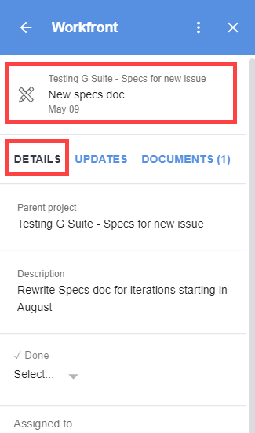

# View and manage *`Adobe Workfront`* object details from G Suite {#view-and-manage-adobe-workfront-object-details-from-g-suite}

You can view and manage the details of a work item without leaving G Suite. For example, you can read a task's description, view its parent object, change its status, and mark it as complete, all within *`Adobe Workfront`* for G&nbsp;Suite.

## Access requirements {#access-requirements}

You must have the following access to perform the steps in this article:

<table style="width: 100%;margin-left: 0;margin-right: auto;mc-table-style: url('../../Resources/TableStyles/TableStyle-List-options-in-steps.css');" class="TableStyle-TableStyle-List-options-in-steps" cellspacing="0"> 
 <col class="TableStyle-TableStyle-List-options-in-steps-Column-Column1"> 
 <col class="TableStyle-TableStyle-List-options-in-steps-Column-Column2"> 
 <tbody> 
  <tr class="TableStyle-TableStyle-List-options-in-steps-Body-LightGray"> 
   <td class="TableStyle-TableStyle-List-options-in-steps-BodyE-Column1-LightGray" role="rowheader">Adobe Workfront plan*</td> 
   <td class="TableStyle-TableStyle-List-options-in-steps-BodyD-Column2-LightGray"> 
Any
 </td> 
  </tr> 
  <tr class="TableStyle-TableStyle-List-options-in-steps-Body-MediumGray"> 
   <td class="TableStyle-TableStyle-List-options-in-steps-BodyB-Column1-MediumGray" role="rowheader">Adobe Workfront license*</td> 
   <td class="TableStyle-TableStyle-List-options-in-steps-BodyA-Column2-MediumGray"> 
Work, Plan
 </td> 
  </tr> 
 </tbody> 
</table>

&#42;To find out what plan, license type, or access you have, contact your *`Workfront administrator`*.

## Prerequisites {#prerequisites}

Before you can view and manage work item details in G Suite, you must

* Install *`Workfront`* for G suite  
  For instructions, see [Install Adobe Workfront for G Suite](install-workfront-for-gsuite.md).

## View and manage work item details in G Suite {#view-and-manage-work-item-details-in-g-suite}

1. If the *`Workfront for G Suite`* panel is not displayed, click the  *`Workfront`* icon  in the G Suite add-ons sidebar at the far-right of the page. 

1.  Go to the *`Workfront`* task or issue within G Suite, as described in [Access Adobe Workfront Home content from G Suite](access-wf-home-content-from-g-suite.md).

   When you select a task or issue, the `Details` tab is open. The area above the `Details` tab displays the name of the parent object, the name of the task or issue, and the Due date (if it's a task) or Priority date (if it's an issue).

   

   You can do various tasks on this tab without leaving G Suite, including the following: 

    
    
    *  View the object's `Description` and other details, such as the users assigned to the object, the `Priority`, the requester, the `Planned completion date`, and any custom fields and forms attached to the object. 
    
    
      Custom forms display only fields where information has been added.
    
    *  Click the `Parent project` area to view the details of the parent object. 
    
    
      >[!TIP] {type="tip"}
      >
      >This can be helpful when you have tasks and issues with the same name and you need to differentiate them.
    
    
    
    * Accept work assigned to you by clicking `Work on it`.
    *  Edit various options, such as `Done` option, the `Status`, and the `Percent complete`. 
    
    
      Under `Percent complete`, type numbers and (optionally) the percentage sign % to indicate your progress on an item. 
    
    * View information about an approval request, including the owner, size, and any attachments. 
    * `Approve` or `Reject` approval requests and documents.
    
    * `Grant` or `Ignore` access requests.
    
    
    

1. (Optional) Click `View in Workfront` to go to the current work item in *`Workfront`*.

`<li>For information about using the Updates tab in Workfront for G Suite, see <a href="update-a-workfront-object-in-gsuite.md" class="MCXref xref">Update a Adobe Workfront object from G Suite</a>.</li>` `<li>For information about using the Documents tab in Workfront for G Suite, see <a href="view-and-manage-documents-in-gsuite.md" class="MCXref xref">View and manage documents from G&nbsp;Suite</a>.</li>`  