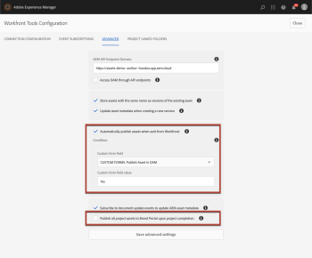

# `Workfront Tools for AEM User Guide : Auto Publish Assets`

## Access requirements

You must have the following access to perform the steps in this article:

<table cellspacing="0"> 
 <col> 
 </col> 
 <col> 
 </col> 
 <tbody> 
  <tr> 
   <td role="rowheader">Adobe Workfront plan*</td> 
   <td> 
Pro or higher
 </td> 
  </tr> <!--
   Adobe Workfront license* Work or higher
  --> 
  <tr> 
   <td role="rowheader">Product</td> 
   <td>You must have a license to Adobe Experience Manager</td> 
  </tr> 
 </tbody> 
</table>

&#42;To find out what plan, license type, or access you have, contact your `Workfront administrator`.

## Prerequisites

* You must install Workfront Tools for Adobe Experience Manager before you can use it to auto publish assets.

  For instructions, see [Workfront Tools for AEM User Guide: Installation Guide 1.x.x](../../workfront-integrations-and-apps/workfront-integration-for-aem/installation-guide.md)

## Auto Publish Assets

<ul> 
 <li> 
Automatically publish assets when sent from Adobe Workfront
 
  <ul> 
   <li> 
This option will enable automatic publishing of assets when they are sent from Workfront to AEM. This feature can be enabled conditionally by specifying a Workfront custom form field&nbsp; and the value it should be set to. Whenever a document is sent to AEM, if it satisfies the condition, then the asset will be automatically published.
 </li> 
  </ul> </li> 
 <li> 
Publish all project assets to Brand Portal upon project completion:
 
  <ul> 
   <li> 
This option will enable automatic publishing of assets to Brand Portal when the status of the Workfront project they belong to is changed to Complete. 
 </li> 
  </ul> </li> 
</ul>

