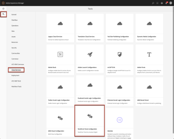
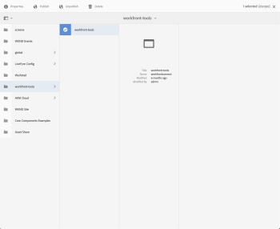
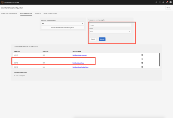
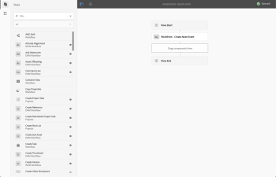
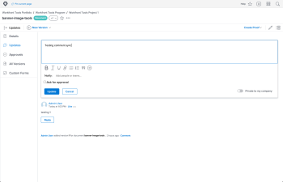
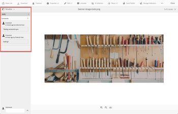

# `Workfront Tools for AEM User Guide : Comments Sync`

Creates a comment under an asset representing the `Adobe Workfront` Note object.

## Access requirements

You must have the following access to perform the steps in this article:

<table cellspacing="0"> 
 <col> 
 </col> 
 <col> 
 </col> 
 <tbody> 
  <tr> 
   <td role="rowheader">Adobe Workfront plan*</td> 
   <td> 
Pro or higher
 </td> 
  </tr> <!--
   Adobe Workfront license* Review or higher
  --> 
  <tr> 
   <td role="rowheader">Product</td> 
   <td>You must have a license to Adobe Experience Manager</td> 
  </tr> 
  <tr> 
   <td role="rowheader">Object permissions</td> 
   <td> 
View permissions to the object the note is attached to
 
For information on requesting additional access, see <a href="../../workfront-basics/grant-and-request-access-to-objects/request-access.md" class="MCXref xref">Request access to objects in Adobe Workfront</a>.
 </td> 
  </tr> 
 </tbody> 
</table>

&#42;To find out what plan, license type, or access you have, contact your `Workfront administrator`.

## Prerequisites

* You must install Workfront Tools for Adobe Experience Manager before you can use it to auto publish assets.

  For instructions, see [Workfront Tools for AEM User Guide: Installation Guide 1.x.x](../../workfront-integrations-and-apps/workfront-integration-for-aem/installation-guide.md)

## Create Event Subscriptions for Note Objects

<ol> 
 <li value="1"> 
Navigate to Tools → Cloud Services → Workfront Tools Configuration. Select the configuration and click Properties. 
 
  
 </li> 
 <li value="2"> 
Select the Event Subscriptions tab. Under the Create a new event subscription menu, select create from the Event dropdown and under the Object dropdown select note. This we create a workflow step that listens for comments added to Workfront linked documents and add the comment in AEM. 
 
  
 
    
 </li> 
 <li value="3"> 
Test the Create Note Event
 
  <ol> 
   <li value="1"> 
Navigate to a linked document in Workfront and leave a comment in the Updates tab.
 </li> 
   <li value="2"> 
Navigate to the same linked document in AEM. Once the document is selected, navigate to the Timeline menu in the left navigation and select Comments. Here you should see you synced comments from Workfront.
 
  
 
  
 </li> 
  </ol> </li> 
</ol>

