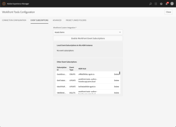

# `Workfront Tools for AEM User Guide : Configure Event Subscriptions`

Event subscriptions are used to notify AEM of events that take place in *Adobe Workfront*. There are three Workfront Tools features that need event subscriptions in order to work, these are:

* Automatic creation of project linked folders.
* Synchronization of changes in *Workfront* document custom form values to AEM asset metadata.
* Automatic publication of assets to Brand Portal upon project completion.

If you plan to use either of these three features, then you should enable Event subscriptions.

## Access requirements

You must have the following access to perform the steps in this article:

<table cellspacing="0"> 
 <col> 
 </col> 
 <col> 
 </col> 
 <tbody> 
  <tr> 
   <td role="rowheader"><em>Adobe Workfront</em> plan*</td> 
   <td> 
<em>Pro</em> or higher
 </td> 
  </tr> <draft-comment>
   <tr data-mc-conditions="QuicksilverOrClassic.Draft mode"> 
    <td role="rowheader"><em>Adobe Workfront</em> license*</td> 
    <td> 
<em>Review</em> or higher
 </td> 
   </tr>
  </draft-comment>
  <tr data-mc-conditions="QuicksilverOrClassic.Draft mode"> 
   <td role="rowheader"><em>Adobe Workfront</em> license*</td> 
   <td> 
<em>Review</em> or higher
 </td> 
  </tr> 
  <tr> 
   <td role="rowheader">Product</td> 
   <td>You must have a license to Adobe Experience Manager</td> 
  </tr> 
 </tbody> 
</table>

&#42;To find out what plan, license type, or access you have, contact your *Workfront administrator*.

## Prerequisites

* You must install Workfront Tools for Adobe Experience Manager before you can use it to configure event subscriptions.

  For instructions, see [Workfront Tools for AEM User Guide: Installation Guide 1.x.x](../../workfront-integrations-and-apps/workfront-integration-for-aem/installation-guide.md)

## Configure event subscriptions

<ol> 
 <li value="1"> 
Edit Workfront Tools Cloud Services configuration you created in step 5 and click on Event Subscriptions tab.
 </li> 
 <li value="2"> 
Select the Workfront Custom Integration you created in section 6.
 </li> 
 <li value="3"> 
Click on Enable Workfront Event Subscriptions.
 
  
 </li> 
</ol>

