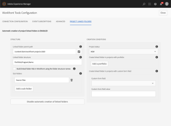

# `Workfront Tools for AEM User Guide : Configure Linked Folders`

## Access requirements

You must have the following access to perform the steps in this article:

<table cellspacing="0"> 
 <col> 
 </col> 
 <col> 
 </col> 
 <tbody> 
  <tr> 
   <td role="rowheader"><span>Adobe Workfront</span> plan*</td> 
   <td> <p><span>Pro</span> or higher</p> </td> 
  </tr> <!--
   Adobe Workfront license* Plan or higher
  --> 
  <tr> 
   <td role="rowheader">Product</td> 
   <td>You must have a license to Adobe Experience Manager</td> 
  </tr> <!--
   Object permissions You must have access to the document folders you want to link For information on requesting additional access, see Request access to objects in Adobe Workfront.
  --> 
 </tbody> 
</table>

&#42;To find out what plan, license type, or access you have, contact your `Workfront administrator`.

## Prerequisites

* You must install Workfront Tools for Adobe Experience Manager before you can use it to configure linked folders.

  For instructions, see [Workfront Tools for AEM User Guide: Installation Guide 1.x.x](../../workfront-integrations-and-apps/workfront-integration-for-aem/installation-guide.md)

## Configuration

1. Event Subscriptions configuration

  1. Go to the `Event Subscriptions` tab in the cloud services.
  1. Select the `custom integration` you created in `Workfront`.
  1. Click `Enable Workfront Event Subscriptions`.

1. Linked folder structure configuration

  1. Go to the `Project Linked Folders` tab in the cloud services.
  1. Linked folder parent path: Select a folder in the DAM where you wish to create the linked folders. If left empty, it will default to /content/dam. Make sure that the `Workfront Tools`metadata schema and `Workfront Linked Folder` folder metadata schema have been applied to the selected folder.
  1. Linked folder structure: Enter comma-separated values. Each value should be DE:<some-project-custom-form-field>, Portfolio, Program, Year, Name, or some "Literal String Value" (this last one with quotation marks). It is currently set to  
  
     ```  
     Portfolio,Program,Year,DE:Project Type,Name
     ```  
  
     .
  1. `Build linked folder title in Workfront using the folder structure names` checkbox should be checked if the title of the folder in Workfront should include all folders in the structure. Otherwise, it will be the title of the last folder.
  1. Sub-folders multifield allows specifying a list of folders that should be created as a child folder of the linked folder.
  1. Project status: Select the status the project has to be set to in order to create the linked folder.
  1. Create a linked folder in projects with portfolio: List of Portfolios that the project has to belong to in order to create the linked folder. Leave this list empty to create the linked folder for all project portfolio.
  1. Create a linked folder in projects with custom form field: Custom form field and its corresponding value that the project has to have in order to create the linked folder. This configuration will be ignored if left empty. Select `CUSTOM FORMS: Create DAM Linked Folder`” for the field and type `Yes`for the value.
  1. Click on `Enable automatic creation of linked folders`. If you go back to the `Event Subscriptions` tab, you'll see there is now one `create`event.

## Linked folder creation

<ol> 
 <li value="1"> <p>Go to <span class="uitext">Projects </span>in <span>Workfront</span> and click on <span class="uitext">+ New Project</span>. Enter a name for your project.</p> </li> 
 <li value="2"> <p>At this point, if you reload the cloud services page, you'll see that there are now 3 active subscriptions:</p> 
  <ol> 
   <li value="1"> <p>For the creation of new projects.</p> </li> 
   <li value="2"> <p>For updates in the project that you just created.</p> </li> 
   <li value="3"> <p>For the case where you delete the project that you just created.</p> </li> 
  </ol> </li> 
 <li value="3"> <p>Go to <span class="uitext">Project Details</span> tab of the new project and to <span class="uitext">Custom Forms</span> sub-tab.</p> </li> 
 <li value="4"> <p>Select <span class="uitext">Workfront Tools Project</span> form.</p> </li> 
 <li value="5"> <p>Edit it and select values for <span class="uitext">Project Type</span>, <span class="uitext">Project Tags</span> and <span class="uitext">Project asset types</span>. Select <span class="uitext">Yes </span>for <span class="uitext">Create DAM Linked Folder</span>. Leave AEM Folder URL empty (it will be populated later by an AEM workflow).</p> </li> 
 <li value="6"> <p>Also in <span class="uitext">Project Details</span> tab, go to <span class="uitext">Portfolio </span>sub-tab and add <span class="uitext">Default Portfolio</span>. Also set the Program to <span class="uitext">Test Program</span>.</p> </li> 
 <li value="7"> <p>Change the project status to whatever you selected in the configuration.</p> </li> 
 <li value="8"> <p>At this point, if you reload the cloud services page, you'll see that <span class="uitext">update </span>and <span class="uitext">delete </span>events are no longer there for your project. These events subscriptions are deleted once they are no longer useful</p> </li> 
 <li value="9"> <p>In your Workfront project, if you go to the <span class="uitext">Documents </span>tab, you'll see the linked folder with name <span class="uitext"><Portfolio>-<Program>-<Project Name>-Deliverables</span> or just <span class="uitext">Deliverables </span>(depending on the option for the checkbox in the cloud services).</p> </li> 
 <li value="10"> <p>You can try uploading documents into this folder or its sub-folder and check that the folder together with its content exists in AEM. Also check that the assets in AEM are identified with a small <span>Workfront</span> icon.</p> </li> 
 <li value="11"> <p>You should also check that the linked folder and the assets that were sent have project metadata in their properties.</p> <p>  </p> </li> 
</ol>

