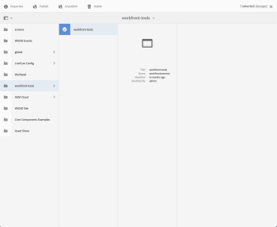

# `Workfront Tools for AEM User Guide : Content Fragments`

This workflow step will allow a user to map *Adobe Workfront* metadata fields to an AEM Content Fragment Model.

## Access requirements

You must have the following access to perform the steps in this article:

<table cellspacing="0"> 
 <col> 
 </col> 
 <col> 
 </col> 
 <tbody> 
  <tr> 
   <td role="rowheader"><em>Adobe Workfront</em> plan*</td> 
   <td> 
<em>Pro</em> or higher
 </td> 
  </tr> <draft-comment>
   <tr data-mc-conditions="QuicksilverOrClassic.Draft mode"> 
    <td role="rowheader"><em>Adobe Workfront</em> license*</td> 
    <td> 
<em>Review</em> or higher
 </td> 
   </tr>
  </draft-comment>
  <tr data-mc-conditions="QuicksilverOrClassic.Draft mode"> 
   <td role="rowheader"><em>Adobe Workfront</em> license*</td> 
   <td> 
<em>Review</em> or higher
 </td> 
  </tr> 
  <tr> 
   <td role="rowheader">Product</td> 
   <td>You must have a license to Adobe Experience Manager</td> 
  </tr> 
 </tbody> 
</table>

&#42;To find out what plan, license type, or access you have, contact your *Workfront administrator*.

## Prerequisites

* You must install Workfront Tools for Adobe Experience Manager before you can use it to map metadata.

  For instructions, see [Workfront Tools for AEM User Guide: Installation Guide 1.x.x](../../workfront-integrations-and-apps/workfront-integration-for-aem/installation-guide.md)

## Create the event subscription

<ol> 
 <li value="1"> 
Navigate to Tools → Cloud Services → Workfront Tools Configuration. Select the configuration and click Properties. 
 
  
 
  
 </li> 
 <li value="2"> 
Select the Event Subscriptions tab. Under the Create a new event subscription menu, select update from the Event dropdown and under the Object dropdown select task if you want to create content fragments from a task custom form or select issue if you want to create content fragments from an issue custom form.
 
  
 </li> 
 <li value="3"> 
Next, navigate back to Tools → Assets → Content Fragment Models. Select an existing Content Fragment Model or create a new model.
 
  
 </li> 
 <li value="4"> 
Select an existing data field or add a new field. With the field selected, navigate to the <em>Workfront</em> Custom Form Field drop-down menu and select the custom form field you’d like to map.
 
  
 </li> 
 <li value="5"> 
After you’ve mapped your desired fields, return to the Tools → Cloud Services → Workfront Tools Configuration.
 
  
 </li> 
</ol>

