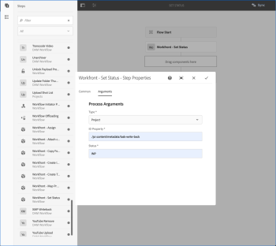

# `Workfront Tools for AEM User Guide : Set Status`

## Access requirements

You must have the following access to perform the steps in this article:

<table cellspacing="0"> 
 <col> 
 </col> 
 <col> 
 </col> 
 <tbody> 
  <tr> 
   <td role="rowheader">Adobe Workfront plan*</td> 
   <td> 
Pro or higher
 </td> 
  </tr> <!--
   Adobe Workfront license* Work or higher
  --> 
  <tr> 
   <td role="rowheader">Product</td> 
   <td>You must have a license to Adobe Experience Manager</td> 
  </tr> 
 </tbody> 
</table>

&#42;To find out what plan, license type, or access you have, contact your `Workfront administrator`.

## Prerequisites

* You must install Workfront Tools for Adobe Experience Manager before you can use it to set statuses.

  For instructions, see [Workfront Tools for AEM User Guide: Installation Guide 1.x.x](../../workfront-integrations-and-apps/workfront-integration-for-aem/installation-guide.md)

## Set Status

This workflow step will allow a user to set `Adobe Workfront` statuses on Projects, Tasks, and Issues. This workflow step can be added to any workflow model. The `Workfront` artifact this step affects will be looked up using a relative path from the payload. The status is statically defined in the dialog configuration.

