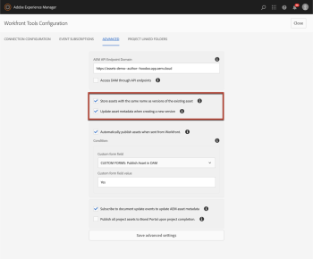
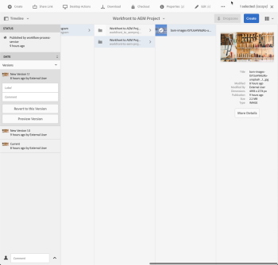

# `Workfront Tools for AEM User Guide : Versioning`

## Access requirements

You must have the following access to perform the steps in this article:

<table cellspacing="0"> 
 <col> 
 </col> 
 <col> 
 </col> 
 <tbody> 
  <tr> 
   <td role="rowheader"><em>Adobe Workfront</em> plan*</td> 
   <td> 
<em>Pro</em> or higher
 </td> 
  </tr> <draft-comment>
   <tr data-mc-conditions="QuicksilverOrClassic.Draft mode"> 
    <td role="rowheader"><em>Adobe Workfront</em> license*</td> 
    <td> 
<em>Work</em> or higher
 </td> 
   </tr>
  </draft-comment>
  <tr data-mc-conditions="QuicksilverOrClassic.Draft mode"> 
   <td role="rowheader"><em>Adobe Workfront</em> license*</td> 
   <td> 
<em>Work</em> or higher
 </td> 
  </tr> 
  <tr> 
   <td role="rowheader">Product</td> 
   <td>You must have a license to Adobe Experience Manager</td> 
  </tr> 
 </tbody> 
</table>

&#42;To find out what plan, license type, or access you have, contact your *Workfront administrator*.

## Prerequisites

* You must install Workfront Tools for Adobe Experience Manager before you can use it.

  For instructions, see [Workfront Tools for AEM User Guide: Installation Guide 1.x.x](../../workfront-integrations-and-apps/workfront-integration-for-aem/installation-guide.md)

## Advanced Settings for Versioning

<ul> 
 <li> 
Store assets with the same name as versions of the existing asset:
 
  <ul> 
   <li> 
When checked, this option will enable storing assets uploaded with the same name and to the same location as the version of the existing asset. If left unchecked, a new asset will be created with a different name (e.g. asset-name.pdf and asset-name-1.pdf)
 </li> 
  </ul> </li> 
 <li> 
Update asset metadata when creating a new version:
 
  <ul> 
   <li> 
When checked, this option will update the asset metadata whenever a new version of the asset is created. If unchecked, the asset will keep the metadata it had prior to creating the new version.
 
  
 </li> 
  </ul> </li> 
</ul>

When an asset has been sent from Workfront to AEM the version history of the asset will be managed in AEM. See [Managing AEM Assets](https://docs.adobe.com/content/help/en/experience-manager-65/assets/managing/managing-assets-touch-ui.html#timeline) for more information.

## Current Limitations of Versioning

* *Workfront* document versioning is currently unsupported within linked folders.

  * When creating a *Workfront* *Proof* with a document inside a linked folder you will lose your previous version’s comments and annotations.

