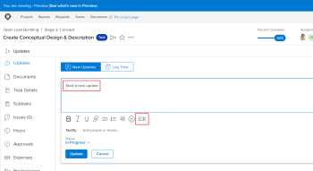
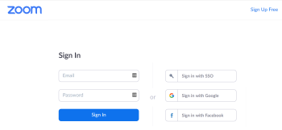
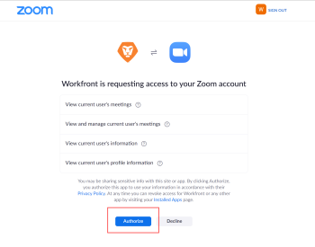

# Authorize the Zoom integration

After your Adobe Workfront administrator enables the Zoom integration, you need to authorize the connection between Workfront and your Zoom account. This is necessary for each Workfront user.

## Access requirements

You must have the following access to perform the steps in this article:

<table cellspacing="0"> 
 <col> 
 <col> 
 <tbody> 
  <tr> 
   <td role="rowheader">Adobe Workfront plan*</td> 
   <td> 
Any
 </td> 
  </tr> 
  <tr> 
   <td role="rowheader">Adobe Workfront license*</td> 
   <td> 
Work, Plan
 </td> 
  </tr> <!--
   Access level configurations* [Insert any access level configurations needed] Example: Edit access to Documents Note: If you still don't have access, ask your Workfront administrator if they set additional restrictions in your access level. For information on how a Workfront administrator can modify your access level, see Create or modify custom access levels. You must be a Workfront administrator. For information on Workfront administrators, see Grant a user full administrative access. You must be a group administrator. For more information on group administrators, see Group administrators.
  --> <!--
   Object permissions [Insert permissions needed and specify the object] Example: View access or higher on Documents For information on requesting additional access, see Request access to objects in Adobe Workfront.
  --> 
 </tbody> 
</table>

&#42;To find out what plan, license type, or access you have, contact your Workfront administrator.

## Prerequisites

Your Workfront administrator must enable the Zoom integration before you can use it.

## Authorize the Zoom integration

1. Go to a Workfront object such as a task or issue.
1. In the left panel, click `Updates` .

1. Click `Start a new update`, then click the camera icon that displays below the box.

   

1. In the Zoom screen that displays, sign in to your Zoom account.

   

   You can use your Zoom login credentials or any other method, such as signing in with Google.

   This authorization process occurs only one time, the first time you click this icon. The same is true for each user in your organization when they click the icon for the first time. 

1. At the bottom of the page that says Workfront is requesting access to your Zoom account, click `Authorize`.

   

   This page closes automatically when the connection is successfully authorized.

   You have connected Workfront to your Zoom account!

   Now you can click the camera icon  in the Workfront Updates area whenever you want to insert a Zoom meeting URL into an update or comment in the Updates area.

   

