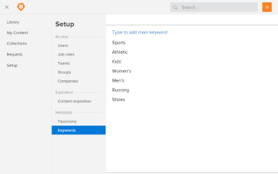

# Add keywords to metadata in `Workfront Library`

Keyword metadata consists of terms that describe the attributes and content of an asset. Users select keywords from the picklist when they upload content to `Workfront Library`. Only keywords in the keyword picklist can be added to content's metadata. For more information about keywords, see [Overview of keyword metadata in Workfront Library](../../../workfront-library/administration-and-setup/metadata/keyword-metadata-overview.md)

As a `Workfront Library administrator`, you can keep your organization's keyword metadata consistent by configuring a keyword picklist.

<ol> 
 <li value="1"> In Workfront, click the Main Menu icon , then select Library to open Workfront Library in a new browser tab. </li> 
 <li value="2"> 
In the upper-left corner of Workfront Library, click the Menu icon .
 </li> 
 <li value="3"> 
In the left panel, click Setup&nbsp;> Keywords.
 </li> 
 <li value="4"> 
Click Type to add main keyword, type the term you want to add, then press Enter.
 
  
 
You cannot enter a term that is already in the keyword list. 
 </li> 
 <li value="5"> 
(Optional) To add a child keyword:
 
  <ol> 
   <li value="1"> 
Hover over the main keyword and select the Add Keyword icon.
 </li> 
   <li value="2">Click Type to add keyword under, type the child keyword, then press Enter.</li> 
   <li value="3">Repeat Step 5 to add additional child keywords to the main keyword.</li> 
  </ol> <note type="tip">
   You can further refine the keyword structure by adding child keywords to the child keywords, and so on.
  </note> </li> 
</ol>

When you exit the keyword setup area, the keywords rearrange to display in alphabetical order.
