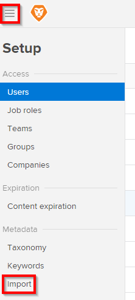
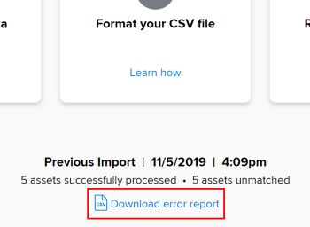

# Use *`Workfront Library`*'s import tool to add metadata to content {#use-workfront-librarys-import-tool-to-add-metadata-to-content}

If you're new to *`Workfront Library`* and have just uploaded hundreds or thousands of assets, there's no need to manually add metadata to each asset individually. A *`Workfront Library`* Administrator can easily import metadata to these assets using a CSV file. To learn more about metadata, see [Overview of metadata in Workfront Library](metadata-overview.md).

>[!NOTE]
>
>Depending on the amount of assets you have, there are 3 options available for adding assets to *`Workfront Library`*: >
>
>
>* Direct upload (recommended if you have less than 50 GB of assets)
>* AWS S3 bucket exchange
>* AWS Snowball
>
>
>If you are a *`Workfront DAM`* customer, you can transfer the metadata through this process. To learn more about any of these options, contact *`Workfront`*'s Professional Services department.

Before you can add the metadata to your uploaded assets, you must set up your metadata schema in *`Workfront Library`* and format your CSV file to meet all requirements. Failure to include the appropriate metadata schema or properly format your CSV file could result in metadata not mapping correctly to your assets.

To learn how to complete these requirements, see:

* [Set up taxonomy metadata for Workfront Library](set-up-taxonomy-metadata.md) 
* [Format your CSV file for metadata import in Workfront Library](format-your-csv-file-for-metadata-import.md) 

After completing the actions above, you can import the file.

1.  In *`Workfront`*, click the *`Workfront Library`* `icon` in the top-right corner of the screen.
1.  In *`Workfront Library`*, click the `Menu icon`, then go to Setup > Metadata > Import.

   

   >[!NOTE]
   >
   >Because you can only import one CSV file at a time, *`Workfront`* recommends importing only one CSV file if you have less than 100,000 rows of metadata.

1.  If your CSV file is properly formatted, click `Choose CSV`, then double-click the file in your computer to upload it. The import begins and you are unable to import additional files until it completes.

   If a row in the CSV file fails to map to an asset in *`Workfront Library`*, a link appears allowing you to download a report detailing the filenames and filepath of rows that did not import. You may need to manually update the metadata for these assets.

   

