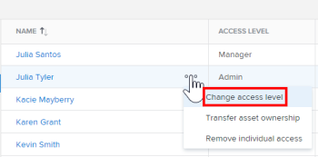
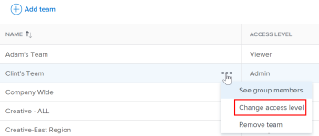

# Change a user's access to Workfront Library

As a Workfront Library administrator, you can change a user's access level in order to increase or decrease the permissions they have to content in Workfront Library. If a user has multiple access sources, their access level is determined by the highest access level they've been assigned. For information on the permissions allowed in each access level, see [Permissions in Workfront Library](../../../workfront-library/administration-and-setup/user-access/permissions-in-workfront-library.md). For information on user access, see [Overview of user access to Workfront Library](../../../workfront-library/administration-and-setup/user-access/user-access-overview.md)

## Change individual access

When you change a user's individual access to Workfront Library, any access that the user has through a user grouping is not affected.

<ol> 
 <li value="1"> In Workfront, click the Main Menu icon , then select Library to open Workfront Library in a new browser tab. </li> 
 <li value="2"> 
In the upper-left corner of Workfront Library, click the Menu icon.
 </li> 
 <li value="3"> 
In the left panel, click Setup > Users.
 </li> 
 <li value="4"> 
Hover over a user's row, click the More menu next to the user's name, and select Change access level from the drop-down list that appears.
 
  
 </li> 
 <li value="5">In the Change individual access drop-down menu, select the access level you want to assign the user, then click Change access.</li> 
</ol>

## Change user grouping access

When you change the access level of a user grouping, you change the access of the users who are members of the grouping.

<ol> 
 <li value="1"> In Workfront, click the Main Menu icon , then select Library to open Workfront Library in a new browser tab. </li> 
 <li value="2"> 
In the upper-left corner of , clickWorkfront Library the Menu icon.
 </li> 
 <li value="3"> 
In the left panel, click Setup, then in the Access section, select the type of user grouping that you want to change access for:
 
  <ul> 
   <li style="font-weight: bold;">Job Roles</li> 
   <li style="font-weight: bold;">Teams</li> 
   <li style="font-weight: bold;">Groups</li> 
   <li style="font-weight: bold;">Companies</li> 
  </ul> 
A list of the user groupings in Workfront Library displays.
 </li> 
 <li value="4"> 
Hover over the user grouping's row, click the More menu, and select Change access level from the drop-down list that appears.
 
  
 </li> 
 <li value="5"> 
In the drop-down menu, select the access level you want to assign the user grouping, then click Change access.
 
The access level of the user grouping updates.
 </li> 
</ol>

