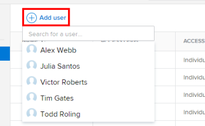

# Give users access to *`Workfront Library`* {#give-users-access-to-workfront-library}

Before users can open *`Workfront Library`*, they must be given access. As a *`Workfront Library administrator`*, you can give your users the following types of access:

* `Individual`: Access that you grant to individual users
* `User grouping`: Access that users receive through their membership in a job role, team, group, or company that you've added to *`Workfront Library`*

When you add individual users and user groupings to *`Workfront Library`*, you assign them an access level. This access level determines what actions users can take with the content that is shared with them. For information on *`Workfront Library`* access levels and permissions, see [Overview of user access to Workfront Library](user-access-overview.md) and [Permissions in Workfront Library](permissions-in-workfront-library.md).

Each access level grants specific permissions that affect what a user can do with the assets shared with them. For information on the permissions allowed for each access level, see 

>[!NOTE]
>
>Users must first have a profile in *`Workfront`* before you can give them access to *`Workfront Library`*. For information on adding users to *`Workfront`*, see [Add users](add-users.md).

## Give individual access {#give-individual-access}

To get individual access to *`Workfront Library`*, a user must be active in *`Workfront`*. You can also restore access for a user you have removed from *`Workfront Library`* previously.

1.  In *`Workfront`*, click the `Main Menu` icon , then select `Library` to open *`Workfront Library`* in a new browser tab.
1.  In the upper-left corner of *`Workfront Library`*, click the `Menu` icon.
1.  In the left panel, click `Setup` > `Users`.
1.  Click `Add user`.

   

1.  In the `Search` box that appears, enter text to locate the user.

   Or

   Scroll down the drop-down list until you've located the user.

1.  In the drop-down list, select each user that you want to give access to.

   After selecting a name, the user appears in the table below.

   >[!NOTE]
   >
   >When you add a new user, they automatically have Viewer access to *`Workfront Library`*. To learn how to change a user's access level to Admin or Manager, see [Change a user's access to Workfront Library](change-user-access.md).

## Give access to a user grouping {#give-access-to-a-user-grouping}

To add a user grouping in *`Workfront Library`*, it must already exist as a grouping in *`Workfront`*. To learn more, see [Overview of user access to Workfront Library](user-access-overview.md).

To give access:

1.  In *`Workfront`*, click the `Main Menu` icon , then select `Library` to open *`Workfront Library`* in a new browser tab.
1.  In the upper-left corner of *`Workfront Library`*, click the `Menu` icon.
1.  In the left panel, click `Setup`, then select the type of user grouping that you want to add:

    
    
    * `Job role` 
    * `Team` 
    * `Group` 
    * `Company` 
    
    

1.  Click `Add`.
1.  In the `Search` box that appears, enter text to locate the user grouping.

   Or

   Scroll down the drop-down list until you've located the user grouping.

1.  In the drop-down list, select each user grouping that you want to give access to.
1. After selecting a user grouping, it appears in the table below. The new users receive an email with a link to *`Workfront Library`*.
1. When you add a user grouping, each user in the group automatically has Viewer access to *`Workfront Library`*. To learn how to change the access level for the user grouping, see [Change a user's access to Workfront Library](change-user-access.md).

