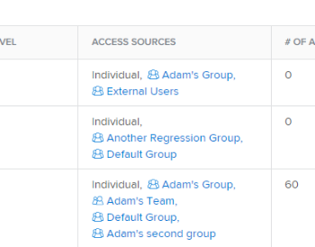
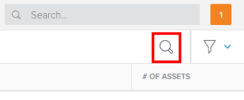
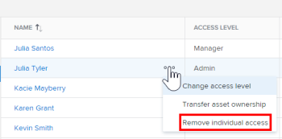
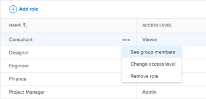

# Remove a user's access to Workfront Library

As a Workfront Library administrator, you can remove a user's access to Workfront Library. When you remove a user from Workfront Library, only their access to Workfront Library is removed. Their Workfront account remains active. Any content that they owned in Workfront Library remains in Workfront Library.

If a Workfront system administrator deactivates a user in Workfront, they automatically lose access to Workfront Library.

>[!TIP]
>
>Before deleting or deactivating a user in Workfront or in Workfront Library, we recommend reassigning the content they own to another Workfront Library user. To access content owned by a deactivated user, users must have View or Manage access to the content. Only users with Manage access can make changes to content owned by a deactivated user.  
>For information on changing the ownership of content, see [Transfer ownership assets to another user](../../../workfront-library/administration-and-setup/manage-assets/transfer-ownership-to-others.md).

A user might have multiple access levels assigned to them. For example, a user can have individual access to Workfront Library and access from any job role, team, group, or company that they are members of. For information on the differences between individual and user grouping access, see [Overview of user access to Workfront Library](../../../workfront-library/administration-and-setup/user-access/user-access-overview.md).

>[!NOTE]
>
>To determine how a user has access to Workfront Library, you can open the Library menu and go to `Setup` > `Access` > `Users`. In the Users area, you see a list of users and the type of access they have is listed in the Access Sources column.  
><![CDATA[		]]>

* [Remove a user's individual access](#remove2) 
* [Remove access for a user grouping](#remove3)

## Remove a user's individual access

Removing a user's individual access to Workfront Library does not affect any other access sources that the user has.

To remove individual access:

<ol> 
 <li value="1"> In Workfront, click the Main Menu icon , then select Library to open Workfront Library in a new browser tab. </li> 
 <li value="2"> 
In the upper-left corner of Workfront Library, click the Menu icon.
 <note type="note">
   To remove a user from a portal, click 
   Portals in the bottom-left panel.
  </note> </li> 
 <li value="3"> 
In the left panel, click Setup > Users.
 </li> 
 <li value="4"> 
To locate the user you want to remove, click the Search icon in the top-right corner, then enter the user's name and hit Enter.
 
  
 
Or
 
Scroll down until you've located the user's name.
 </li> 
 <li value="5"> 
Next to the user's name, click the More menu, then select Remove individual access.
 
  
 </li> 
 <li value="6"> 
(Optional) If the user owns assets and doesn't have access through a user grouping, you must select what you would like to do with the assets:
 
  <ul> 
   <li>Transfer the assets to a different user</li> 
   <li>Delete the assets</li> 
   <li>Keep the assets without transfering them to a new owner</li> 
  </ul> <note type="note">
   If you choose to keep the assets assigned to the user that you're removing, you can transfer the assets later. If you select to transfer the assets now, you must select a new owner to assign them to. To learn more about transfering assets, see 
   <a href="../../../workfront-library/administration-and-setup/manage-assets/transfer-ownership-to-others.md" class="MCXref xref">Transfer ownership assets to another user</a>.
  </note> </li> 
 <li value="7"> 
In the Remove individual access dialog, click Remove user.
 
The user appears in the Deactivated users list.
 <note type="note">
   If you want to restore access for an inactive user, you can locate them by clicking the Filter icon, then selecting 
   Deactivated users from the menu. After finding the Deactivated users list, you can select 
   Restore user access from the More Menu.
  </note> </li> 
</ol>

## Remove access for a user grouping

As a Workfront Library administrator, you can remove access to Workfront Library for an entire group of users based on their user groupings:

* Job role
* Team
* Group
* Company

Users who are members of the removed user grouping lose their access to Workfront Library and all the content shared with the grouping, unless they have individual access to Workfront Library or access through another user grouping in Workfront Library. For information on Workfront Library access levels and permissions, see [Overview of user access to Workfront Library](../../../workfront-library/administration-and-setup/user-access/user-access-overview.md)

>[!NOTE]
>
>If you don't want specific users to access Workfront Library through a job role, team, group, or company, you need to remove them from that specific user grouping in Workfront. To learn how to make these changes from the user profile, see [Edit a user's profile](../../../administration-and-setup/add-users/create-and-manage-users/edit-a-users-profile.md).  
>Alternatively, you can remove them from a user grouping by modifying the job role, team, group, or company that they are a member of. To learn more, see:  
>
>* [Create and manage job roles](../../../administration-and-setup/set-up-workfront/organizational-setup/create-manage-job-roles.md)
>* [Edit team settings](../../../people-teams-and-groups/create-and-manage-teams/edit-team-settings.md)
>* [View and manage a group’s memberships](../../../administration-and-setup/manage-groups/create-and-manage-groups/view-and-manage-a-groups-memberships.md)
>* [Create and edit companies](../../../administration-and-setup/set-up-workfront/organizational-setup/create-and-edit-companies.md)
>

To remove access for a user grouping in Workfront Library:

<ol> 
 <li value="1"> In Workfront, click the Main Menu icon , then select Library to open Workfront Library in a new browser tab. </li> 
 <li value="2"> 
In the upper-left corner of Workfront Library, click the Menu icon.
 <note type="note">
   To remove a grouping from a portal, click 
   Portals in the bottom-left panel.
  </note> </li> 
 <li value="3"> 
In the left panel, click Setup, then select the type of user grouping you want to remove access for:
 
  <ul> 
   <li>Job role </li> 
   <li>Team </li> 
   <li>Group </li> 
   <li>Company </li> 
  </ul> 
A list of the user groupings for the selected type displays in Workfront Library.
 </li> 
 <li value="4"> 
Click the More menu inline with the user grouping that you want to remove.
 
  
 </li> 
 <li value="5"> 
Click Remove, then click Remove to confirm.
 
The user grouping is removed from Workfront Library. Removing a user grouping from Workfront Library does not delete the user grouping in Workfront. 
 <note type="note">
   To transfer assets owned by members of the grouping, you must go to the Deactivated users list. To learn more about transfering assets, see 
   <a href="../../../workfront-library/administration-and-setup/manage-assets/transfer-ownership-to-others.md" class="MCXref xref">Transfer ownership assets to another user</a>.
  </note> </li> 
</ol>

