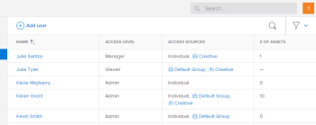
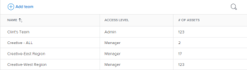

# Overview of user access to *`Workfront Library`* {#overview-of-user-access-to-workfront-library}

By default, when a system administrator integrates *`Workfront`* with *`Workfront Library`*, only users with administrative rights within *`Workfront`* can access *`Workfront Library`*. For information on setting up *`Workfront`* to integrate with *`Workfront Library`*, see [Configure document integrations](configure-document-integrations.md).

As a *`Workfront Library administrator`*, you can give *`Workfront`* users access to *`Workfront Library`* by adding them as users in *`Workfront Library`*. For more information on giving users access, see [Give users access to Workfront Library](give-users-access-to-library.md).

## Access sources {#access-sources}

A user can have access to *`Workfront Library`* through the following sources:

* `Individual access`: Access given to a specific user
* `User grouping access`: Access given to an entire group of users that are part of a job role, team, group, or company that exists in *`Workfront`*

>[!TIP] {type="tip"}
>
>Before adding a user grouping to *`Workfront Library`*, be sure it is organized in such a way to coincide with how your organization uses digital content. You can't create user groupings in *`Workfront Library`* and changes to these user groupings can only be managed in *`Workfront`*, which includes adding and deleting users. For example, if you have a group of users in the Finance Department that needs access to specific documents, you can create a *`Workfront`* team that consists of those users. You can then add the team to *`Workfront Library`* and give team members access to content relevant to their work.

`<li>You can give access to the following user groupings:</li>` 

* `Job roles`: Includes users assigned to a specified skill set or functional capacity, such as engineer, designer, or consultant. For information about job roles in *`Workfront`*, see [Create and manage job roles](create-manage-job-roles.md).

* `Teams`: Includes individuals who are functionally organized into a working unit, such as Creative team. For information about teams in *`Workfront`*, see [Teams overview](teams-overview.md).

* `Groups`: Includes users associated with a unit within an organization, such as a department. For information about groups in *`Workfront`*, see [Groups overview](groups.md).

* `Companies`: Includes users within a specific organization or department, or an outside client. For information about companies in *`Workfront`*, see [Create and edit companies](create-and-edit-companies.md).

## Access levels {#access-levels}

There are 3 access levels in *`Workfront Library`*. Each access level grants specific permissions to users that allow or restrict activities in *`Workfront Library`*.

You can assign users the following access levels:

* `Admin`: Allows a user access to everything in *`Workfront Library`*, including assigning, modifying, or deleting a user's individual access

* `Manager`: Allows a user to upload content and edit or share content that they own or have Manage permission for
* `Viewer`: Allows a user to view and download content that they have View permission for

>[!NOTE]
>
>*`Workfront`* system administrators automatically have Admin access to *`Workfront Library`*. However, users who have Admin access in *`Workfront Library`* don't automatically have system administrator permissions in *`Workfront`*. All other users are given Viewer access by default when you add them, unless you change their access level or they are added to a user grouping with a higher access level.

These access levels determine the highest permissions that users have to shared content. For information on the permissions of each access level, see [Permissions in Workfront Library](permissions-in-workfront-library.md). Individuals who don't have a profile in *`Workfront`* can be given access to only a specific asset through a shared link. For more information, see [Share a Workfront Library item with other users](share-an-asset-with-users.md).

If a user has access through multiple sources and the access levels in these sources are different, the user operates at the highest access level. For example, if Joan is given individual access as a Viewer but also has Manager access through a job role, then she has Manager access. If she is removed from her current job role and her new job role doesn't have access to *`Workfront Library`*, then she has Viewer access.

## Users screen {#users-screen}

You can see information for all *`Workfront Library`* users by going to the the Main Menu, then selecting Setup >&nbsp;Users:

Above the User table, you can:

* Add new users to *`Workfront Library`*
* Search for a specific user
* Filter the screen to see a list of deactivated users

Each column in the table gives you additional options.

<table style="width: 100%;margin-left: 0;margin-right: auto;mc-table-style: url('../../../Resources/TableStyles/TableStyle-List-options-in-steps.css');" class="TableStyle-TableStyle-List-options-in-steps" cellspacing="0"> 
 <col class="TableStyle-TableStyle-List-options-in-steps-Column-Column1"> 
 <col class="TableStyle-TableStyle-List-options-in-steps-Column-Column2"> 
 <tbody> 
  <tr class="TableStyle-TableStyle-List-options-in-steps-Body-LightGray"> 
   <td class="TableStyle-TableStyle-List-options-in-steps-BodyE-Column1-LightGray" role="rowheader">Name</td> 
   <td class="TableStyle-TableStyle-List-options-in-steps-BodyD-Column2-LightGray"> 
In the Name column, you can select a user's name to open Workfront in another tab and view the user's Profile page. You can also click the More menu within a user's row to:
 
    <ul> 
     <li>Change a user's access level</li> 
     <li>Transfer a user's assets to a different user</li> 
     <li>Remove individual access for a user</li> 
    </ul> </td> 
  </tr> 
  <tr class="TableStyle-TableStyle-List-options-in-steps-Body-MediumGray"> 
   <td class="TableStyle-TableStyle-List-options-in-steps-BodyE-Column1-MediumGray" role="rowheader">Access level</td> 
   <td class="TableStyle-TableStyle-List-options-in-steps-BodyD-Column2-MediumGray">The Access level column displays the access level for each user. To learn more about access levels, see <a href="#access2" class="MCXref xref">Access levels</a>.</td> 
  </tr> 
  <tr class="TableStyle-TableStyle-List-options-in-steps-Body-LightGray"> 
   <td class="TableStyle-TableStyle-List-options-in-steps-BodyE-Column1-LightGray" role="rowheader">Access sources</td> 
   <td class="TableStyle-TableStyle-List-options-in-steps-BodyD-Column2-LightGray">In the Access sources column, you can see how a user has access to Workfront Library. If a user was explicitly added, "Individual" appears in this column. If the user has access through a user grouping, the name of the grouping appears in the column and you can click the linked name to go to the Job roles, Teams, Groups, or Companies area within Workfront Library. To learn more about access sources in Workfront Library, see <a href="#access" class="MCXref xref">Access sources</a>. To learn more about the user grouping areas, see <a href="#user" class="MCXref xref">User groupings screens</a>.</td> 
  </tr> 
  <tr class="TableStyle-TableStyle-List-options-in-steps-Body-MediumGray"> 
   <td class="TableStyle-TableStyle-List-options-in-steps-BodyB-Column1-MediumGray" role="rowheader"># of assets</td> 
   <td class="TableStyle-TableStyle-List-options-in-steps-BodyA-Column2-MediumGray">The # of assets column displays the number of assets owned by each user. If the user has Viewer access, a dash appears in this column which indicates that they have no assets and they can't own assets.</td> 
  </tr> 
 </tbody> 
</table>

## User groupings screens {#user-groupings-screens}

You can see information for user groupings by going to the the Main Menu, then selecting Setup > Users:

Above each user grouping table, you can:

* Add a new user grouping to *`Workfront Library`*
* Search for a specific user grouping
* Filter the screen to see a list of deactivated users

In the Setup area for each type of user grouping, you can see the following columns:

<table style="width: 100%;mc-table-style: url('../../../Resources/TableStyles/TableStyle-HeaderRow.css');" class="TableStyle-TableStyle-HeaderRow" cellspacing="15"> 
 <col class="TableStyle-TableStyle-HeaderRow-Column-Column1"> 
 <col class="TableStyle-TableStyle-HeaderRow-Column-Column1"> 
 <tbody> 
  <tr class="TableStyle-TableStyle-HeaderRow-Body-LightGray"> 
   <td class="TableStyle-TableStyle-HeaderRow-BodyE-Column1-LightGray">Name</td> 
   <td class="TableStyle-TableStyle-HeaderRow-BodyD-Column1-LightGray"> 
The Name column displays a list of the user groupings that have access to Workfront Library. If you click the More menu within a user grouping's row, you can select to:
 
    <ul> 
     <li>See all members in the user grouping</li> 
     <li>Change the access level of the user grouping</li> 
     <li>Remove the user grouping from Workfront Library</li> 
    </ul> </td> 
  </tr> 
  <tr class="TableStyle-TableStyle-HeaderRow-Body-MediumGray"> 
   <td class="TableStyle-TableStyle-HeaderRow-BodyE-Column1-MediumGray">Access level</td> 
   <td class="TableStyle-TableStyle-HeaderRow-BodyD-Column1-MediumGray">The Access level column displays the access level for each user grouping. To learn more about access levels, see <a href="#access2" class="MCXref xref">Access levels</a>. After you add a user grouping to Workfront Library, you can assign the grouping a different access level. All members of the user grouping automatically have this access level (unless they have a higher access level through another source) and have permissions to all the content shared with the grouping.</td> 
  </tr> 
  <tr class="TableStyle-TableStyle-HeaderRow-Body-LightGray"> 
   <td class="TableStyle-TableStyle-HeaderRow-BodyB-Column1-LightGray"># of assets</td> 
   <td class="TableStyle-TableStyle-HeaderRow-BodyA-Column1-LightGray">The # of assets column displays the number of assets owned by users in the user grouping. If the user grouping has Viewer access and all members of the user grouping don't have higher access through another source, a dash appears in this column.</td> 
  </tr> 
 </tbody> 
</table>

