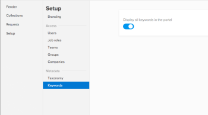

# Set up a portal in `Workfront Library`

Depending on the amount of content your organization stores in `Workfront Library`, your users might find it beneficial to assemble all the items they need in one place.

## `Workfront Library` portals overview

As a `Workfront Library administrator` you can use a portal to gather related content and make it available to internal and external users.

Users with Manager access or higher to a portal can add or remove users from the portal. For more information on managing portal users, see [Give users access to a Workfront Library portal](../../../workfront-library/administration-and-setup/user-access/give-users-access-portal.md).

There is no limit on the number of `Workfront Library` portals your organization can have. Your `Workfront Library` package includes 10 portals. To purchase additional portals, contact your sales representative.

>[!IMPORTANT]
>
>You must contact Customer Success Manager or `Workfront` Support to create a portal.

## Set up a portal

<ol> 
 <li value="1"> In Workfront, click the Main Menu icon , then select Library to open Workfront Library in a new browser tab. </li> 
 <li value="2"> 
In the upper-left corner of Workfront Library, click the Menu icon .
 </li> 
 <li value="3"> 
In the left panel, click Portals.
 
  
 </li> 
 <li value="4">Select the portal you want to configure.</li> 
 <li value="5"> 
Click the Menu icon in the upper-left corner of the portal, then click Setup.
 
You can continue with the portal set up in the following ways:
 
  <ul> 
   <li><a href="#add" class="MCXref xref">Add your organization's branding to the portal</a> </li> 
   <li><a href="#select" class="MCXref xref">Select taxonomy for content in the portal</a> </li> 
   <li><a href="#enable" class="MCXref xref">Enable searching for keywords in the portal</a> </li> 
  </ul> </li> 
</ol>

### Add your organization's branding to the portal

You can brand a portal with your company logo or another image.

<ol> 
 <li value="1">Complete the steps 1-5 in <a href="#set" class="MCXref xref">Set up a portal</a></li> 
 <li value="2">In the Setup panel, click Branding.</li> 
 <li value="3"> 
Hover over the NO LOGO box, then click Select new image.
 </li> 
 <li value="4"> 
Browse to the image you want to use for the branding, then click Open.
 
  
 
The image can be up to a 1,000 x 1,000 pixel image in one of following file formats:
 
  <ul> 
   <li>JPG</li> 
   <li>GIF</li> 
   <li>PNG</li> 
  </ul> <note type="tip">
   If the image you want to use for your branding is in 
   Workfront Library, but it doesn't meet the formatting requirements, you can download the image with a different file size and format. You can then upload the image and use it for branding the portal. For more information on downloading a file, see the "Download a single content file" section in the article 
   <a href="../../../workfront-library/content-management/basics/download-content-from-library.md" class="MCXref xref">Download items from Workfront Library</a>
  </note> </li> 
 <li value="5"> 
Click Save New Logo.
 
Refresh the browser page where you have Workfront Library to see the new logo.
 </li> 
</ol>

### Select taxonomy for content in the portal

Your portal users might not need to view all the taxonomy you collect on your organization's assets. To give portal users only the metadata they need, you can specify the taxonomy fields that display on content added to the portal.

1. Complete the steps 1-5 in [Set up a portal](#set)
1. In the `Setup` panel, click `Taxonomy`.

   A list of your organization's taxonomy displays.

1. Enable the taxonomy fields you want displayed in the metadata for content in the portal.

   While in the portal, users see only the metadata you have enabled.

   For more information on taxonomy metadata, see [Overview of taxonomy metadata in Workfront Library](../../../workfront-library/administration-and-setup/metadata/taxonomy-metadata-overview.md).

### Enable searching for keywords in the portal

You can allow keyword metadata to display for content in the portal. This enables users to search for and filter portal content. While in the portal, you cannot add or remove keywords from the keyword picklist. For more information on keyword metadata, see [Overview of keyword metadata in Workfront Library](../../../workfront-library/administration-and-setup/metadata/keyword-metadata-overview.md)

<ol> 
 <li value="1">Complete the steps 1-5 in <a href="#set" class="MCXref xref">Set up a portal</a></li> 
 <li value="2">In the Setup panel, click Keywords.</li> 
 <li value="3"> 
Enable Display all keywords in the portal. 
 </li> 
</ol>

<![CDATA[]]> 