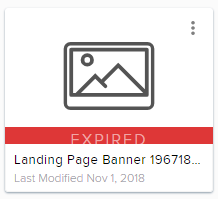
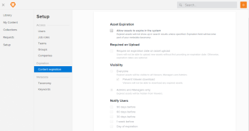
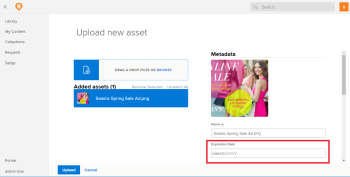

# Set up content expiration in *Workfront* Library

As a *Workfront Library* administrator, you can set up content expiration to either restrict or eliminate users' access to expired content.

Content expiration can be useful when you want to prevent users from accessing out-of-date content or when you have content that should be used only for a specific period of time, such as time-sensitive advertising or licensing materials.

## Content expiration overview

Once you set up content expiration, users can specify an expiration date in the metadata of content when they upload files. In addition, users with Manage permissions to content shared with them can add or edit expiration metadata.

When you set up content expiration, you specify who can access expired content based on users' permission levels. You can also determine whether users can search for and download expired content. Users with Manage permission to content that has expired can activate the Show Expired filter, which allows them to view expired items. For information on using the Show Expired filter, see [Filter for expired content in Workfront Library](../../../workfront-library/content-management/filters/filter-for-expired-content.md).

An expiration date applies only to content in *Workfront Library*. Content that is also in Workfront is not affected by expiration. Folders, collections, and portals cannot expire.

Expired content remains in Workfront Library and displays an Expired banner.

When an asset shared with a portal or collection expires, the link to the asset becomes disabled. Additionally, if an asset that is shared via a public link expires, the public link becomes inactive. <![CDATA[  ]]>

You can configure *Workfront Library* to send an email to the content owner to alert them of the impending expiration of the content.

Expired items migrated from *Workfront DAM* to *Workfront Library* remain expired.

## Setup content expiration

<ol> 
 <li value="1"> <draft-comment>
   
In <em>Workfront</em>, click the Main Menu icon , then select Library to open <em>Workfront Library</em> in a new browser tab.

  </draft-comment>
In <em>Workfront</em>, click the Main Menu icon , then select Library to open <em>Workfront Library</em> in a new browser tab.
 </li> 
 <li value="2"> 
In the upper-left corner of <em>Workfront Library</em>, click the Menu icon .
 </li> 
 <li value="3"> 
In the left panel, click Setup&nbsp;> Content expiration.
 
  
 </li> 
 <li value="4"> 
In the Asset Expiration section, select Allow assets to expire in the system.
 
This option adds the Expiration Date field to the taxonomy and allows users to enter an expiration date when uploading new content.
 
  
 
For more information about taxonomy, see <a href="../../../workfront-library/administration-and-setup/metadata/taxonomy-metadata-overview.md" class="MCXref xref">Overview of taxonomy metadata in Workfront Library</a>.
 </li> 
 <li value="5"> 
(Optional) To require users to specify whether content has an expiration date, select Require an expiration date on asset upload.
 
This option requires users to either enter an expiration date or select No Date before content is uploaded.
 
  
 <note type="note">
   If a user opens an asset that was uploaded prior to your system requiring content expiration metadata, the expiration taxonomy field is added to the asset's metadata. 
   <em>Workfront Library</em> will require the user to either enter an expiration date or select No Date.
  </note> </li> 
 <li value="6">In the Visibility section, specify who can view expired content by choosing one of the following options: 
  <ul>
   <li>Everyone: All users with permissions to the expired content can view the content and can also see it in search results.
    <ul>
     <li>Users with View permission to the expired content can see it in their personal collections.</li>
     <li>Users with Manage permission to the expired content can see it in their Shared With Me or My Library areas and in any collections to which they have access.  </li>
    </ul></li>
   <li>Admins and Managers only: Only users with Admin access to <em>Workfront Library</em> or Manage permission to the expired content can view the content and see it in search results.
    <ul>
     <li>Users with View permission to the expired content cannot view it in <em>Workfront Library</em> once it expires.</li>
     <li>Users with Manage permission to the expired content can view it in their Shared With Me or My Library areas and in any collections to which they have access.</li>
    </ul>
For more information on content permissions, see <a href="../../../workfront-library/administration-and-setup/user-access/permissions-in-workfront-library.md" class="MCXref xref"> Permissions in Workfront Library</a>.
</li>
  </ul></li> 
 <li value="7">(Conditional) If you selected Everyone in Step 6 and you want to prevent users from downloading or sharing expired content to which they have View permission, select Prevent Viewer download. When this option is enabled, all&nbsp;public links to expired content become disabled.</li> 
 <li value="8"> 
(Optional) To notify content owners of the impending expiration of their content, in the Notify Users section select the days you want email notifications sent.
 
You can select multiple options.
 
Workfront sends an email notification only when the active (most current) version of content is expiring. No notification is sent when older versions of content expire. For more information about how content versions are managed in <em>Workfront Library</em>, see <a href="../../../workfront-library/content-management/content-versioning/content-versioning-overview.md" class="MCXref xref">Overview of content versioning in Workfront Library</a>.
 </li> 
 <li value="9">Click Save.&nbsp;</li> 
</ol>

