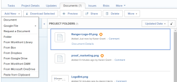
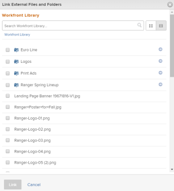

# Add a Workfront Library asset to Workfront

You can add a document that resides in your My Content area to a project, task, or issue in `Workfront`. In order to add a document to `Workfront` from `Workfront Library`, you must have the following permissions:

* Manage access to the document in `Workfront Library`
* Access to the `Workfront` object to which you want to add the document

When you add a document from `Workfront Library` to `Workfront`, `Workfront` creates a copy of the document. This copy is not linked to the document in `Workfront Library`, and changes made to one copy of the document are not updated in the other copy. Additionally, if you send a new version of a document that is already in `Workfront`, the new version is uploaded as a separate file with the same name as the original version.

To learn how to send a document from `Workfront` to `Workfront Library`, see [Send documents from Workfront to Workfront Library](../../workfront-library/content-management/send-documents-from-wf-to-library.md).

<ol> 
 <li value="1"> 
In Workfront, navigate to the Documents tab of the object where you want to add a document from Workfront Library.
 </li> 
 <li value="2"> 
Click Add New.
 
  
 </li> 
 <li value="3"> 
In the drop-down menu, click From Workfront Library.
 
  
 </li> 
 <li value="4"> 
In the Link External Files and Folders dialog box, navigate to the document you want to add to Workfront, and select it.
 </li> 
 <li value="5"> 
Repeat Step 4 to add multiple documents to a Workfront object.
 </li> 
 <li value="6"> 
Click Link.
 
Workfront adds the document to the Workfront object. On the Documents tab for the Workfront object, any documents added from Workfront Library display the Workfront icon.
 </li> 
</ol>

