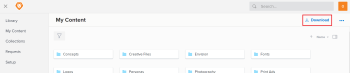

# Download items from *`Workfront Library`* {#download-items-from-workfront-library}

You can download any item to which you have permissions. For information on access and permissions, see [Overview of user access to Workfront Library](user-access-overview.md)

## Understand downloading items {#understand-downloading-items}

You can download the following items from Workfront or from a portal:

* Content
* Folders
* Collections

Depending on how your *`Workfront Library administrator`* set up *`Workfront Library`*, users with Viewer access to *`Workfront Library`* might not be able to download expired content. For more information on the expiration feature, see [Set up content expiration in Workfront Library](set-up-content-expiration-in-library.md).  

Content that you download is saved to the area you designate in your browser. For downloading large files and groups of items, such as folders and collections, *`Workfront Library`* places the items in a .zip file and emails the file to you.

Only the XMP and EXIF metadata downloads with content files. 

You can change the file format of an item you download. Only the format of the downloaded file is changed. The format of the file in *`Workfront Library`* remains unchanged. 

If you change the file format of the item and then upload it back to *`Workfront Library`*, the item is treated as a new version. If the item is an image file, XMP and EXIF metadata of the orginal file is not applied to the new version. For more information see, [Upload a new version of content in Workfront Library](upload-new-version-of-content.md).

## Download content  {#download-content}

`<body>  <ol>   <li value="1"> 
In the upper-left corner of Workfront Library, click the Menu icon .
 </li>   <li value="2"> 
Select the area where the item you want to download is located.
 
Depending on your access level to Workfront Library, you might be able to choose Library, My Content , or Collections. 
 
  
 </li>   <li value="3"> 
(Conditional) If you are in the list view, click the Show grid view icon  to switch to the grid view.
 </li>   <li value="4">Navigate to the item.</li>   <li value="5"> 
Hover over the item, and click the More icon in the upper-right corner of the item, then select Download in the drop-down menu.
 
The Download dialog opens.
 </li>   <li value="6"> 
(Conditional) If you are downloading an image file, select the desired options in the Download dialog, then click Download.
 
  
 
You can specify the following download options for an image file:
    <table style="width: 100%;mc-table-style: url('../../../Resources/TableStyles/TableStyle-List-options-in-steps.css');" class="TableStyle-TableStyle-List-options-in-steps" cellspacing="0">     <col style="width: 117px;" class="TableStyle-TableStyle-List-options-in-steps-Column-Column1">     <col class="TableStyle-TableStyle-List-options-in-steps-Column-Column2">     <tbody>      <tr class="TableStyle-TableStyle-List-options-in-steps-Body-LightGray">       <td class="TableStyle-TableStyle-List-options-in-steps-BodyE-Column1-LightGray" role="rowheader">Version </td>       <td class="TableStyle-TableStyle-List-options-in-steps-BodyD-Column2-LightGray"> 
The Version field displays when there is more than one version of the content. If you have Manage permissions to the content, you can download older versions. Users with View permissions can download only the active (current) version of the content.
 </td>      </tr>      <tr class="TableStyle-TableStyle-List-options-in-steps-Body-MediumGray">       <td class="TableStyle-TableStyle-List-options-in-steps-BodyE-Column1-MediumGray" role="rowheader">Format </td>       <td class="TableStyle-TableStyle-List-options-in-steps-BodyD-Column2-MediumGray"> 
You can change the file formats to one of the following:
        <ul>         <li>Image files:         <ul>          <li>GIF</li>          <li>JPG</li>          <li>BMP</li>          <li>PDF</li>          <li>PNG</li>          <li>TIFF</li>         </ul></li>        </ul> 
Only the format of the downloaded file is changed. The format of the file in Workfront Library remains unchanged. 
 </td>      </tr>      <tr class="TableStyle-TableStyle-List-options-in-steps-Body-LightGray">       <td class="TableStyle-TableStyle-List-options-in-steps-BodyE-Column1-LightGray" role="rowheader">Height and width </td>       <td class="TableStyle-TableStyle-List-options-in-steps-BodyD-Column2-LightGray"> You can resize the image by indicating a pixel measurement in either the Width box or the Height box. The resizing feature is an aspect ratio of the width and height of the image, which prevents distortion.</td>      </tr>      <tr class="TableStyle-TableStyle-List-options-in-steps-Body-MediumGray">       <td class="TableStyle-TableStyle-List-options-in-steps-BodyB-Column1-MediumGray" role="rowheader">Color space </td>       <td class="TableStyle-TableStyle-List-options-in-steps-BodyA-Column2-MediumGray"> 
Color space describes the range of colors available. For example, the RGB color model is composed all the colors created from red, green, and blue. 
 
You can choose from the following color space options:
        <ul>         <li>RGB: Select this option when using the image on a website or for online viewing</li>         <li>CMYK: Select this option when printing the image</li>         <li>Greyscale:&nbsp;Select this option to adjust color images to greyscale</li>        </ul> </td>      </tr>     </tbody>    </table> </li>   <li value="7"> 
(Conditional) If you are downloading a document file, select the desired file format in the Download dialog, then click Download.
 
  
 
You can specify the following download options for a document:
    <table style="width: 100%;mc-table-style: url('../../../Resources/TableStyles/TableStyle-List-options-in-steps.css');" class="TableStyle-TableStyle-List-options-in-steps" cellspacing="0">     <col class="TableStyle-TableStyle-List-options-in-steps-Column-Column1" style="width: 119px;">     <col class="TableStyle-TableStyle-List-options-in-steps-Column-Column2">     <tbody>      <tr class="TableStyle-TableStyle-List-options-in-steps-Body-LightGray">       <td class="TableStyle-TableStyle-List-options-in-steps-BodyE-Column1-LightGray" role="rowheader">Version</td>       <td class="TableStyle-TableStyle-List-options-in-steps-BodyD-Column2-LightGray">The Version field displays only if there is more than one version of the document file. If you have Manage permission to the file, you can download older versions. Users with View permissions can download only the active version of the document.</td>      </tr>      <tr class="TableStyle-TableStyle-List-options-in-steps-Body-MediumGray">       <td class="TableStyle-TableStyle-List-options-in-steps-BodyB-Column1-MediumGray" role="rowheader">Format</td>       <td class="TableStyle-TableStyle-List-options-in-steps-BodyA-Column2-MediumGray"> 
You can change the format of the downloaded file to PDF.
 
Only the format of the downloaded file is changed. The format of the file in Workfront Library remains unchanged. 
 </td>      </tr>     </tbody>    </table> </li>  </ol>  <h2>Download folders and collections</h2>  
Depending on the size of the folder or collection you want to download, its might be placed in a .zip file that is emailed to you. Only the content to which you have permissions is included in the .zip file. 
  <ol>   <li value="1"> 
In the upper-left corner of Workfront Library, click the Menu icon .
 </li>   <li value="2"> 
(Conditional) If you are in Workfront Library and you want to download a folder, select the area where the folder you want to download is located.
 
Depending on your access level, you might be able to choose Library, My Content , or Collections. 
 </li>   <li value="3"> 
(Conditional) If you want to download a collection, select Collections.
 
&nbsp;
 
  
 </li>   <li value="4">Navigate to the item you want to download.</li>   <li value="5"> 
Hover over the item, click the More icon in the upper-right corner, then select Download in the drop-down menu.
 
The folder or collection is either downloaded or placed in a .zip file and emailed to you.
 </li>  </ol> </body>` 

##  

## Download multiple items {#download-multiple-items}

You can download multiple types of files in the same batch. For example, you can down folders, collections, and content files at the same time. Depending on the size of the download, the items might be placed in a .zip file and emailed to you.

1.  In the upper-left corner of *`Workfront Library`*, click the `Menu` icon .
1.  Select the area where the items you want to download are located.

   Depending on your access level to *`Workfront Library`*, you might be able to choose Library, My Content , or Collections. 

   If the items you want to download are spread out on different areas, you will need to do a download batch for each area separately.

1.  (Conditional) If you are in the list view, click the `Show grid view` icon  to switch to the grid view.
1. Select the items you want to download by pressing the Ctrl key and clicking each item.
1.  Click `Download` in the upper-right corner of the window.

   

   Click the `Document` icon in the upper-right corner of the window, then select `Download`.

   The items are either downloaded or placed in a .zip file and emailed to you.

