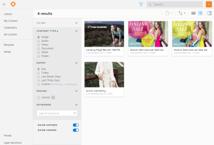
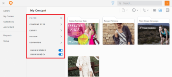
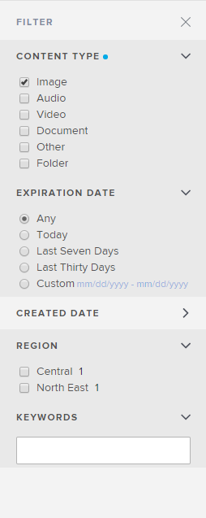

# Filter content displayed in Workfront Library

You can use filters to reduce the amount of content that displays in the Library and My Content areas. You can also use filters to narrow Search results. For information on using Search, see [Search for items in Workfront Library](../../../workfront-library/content-management/basics/search-for-items-in-workfront-library.md).

The available filters display in the Filter panel on the left side of the content area.

Each filter on the Filter panel contains facets, which are filters that allow you to specify the exact content you want to view. A facet filters content based on the metadata attached to content files.

If your organization allows you to add keywords to uploaded content, you can enhance your filtering by selecting the keywords you want to filter for.

<ol> 
 <li value="1"> In Workfront, click the Main Menu icon , then select Library to open Workfront Library in a new browser tab. </li> 
 <li value="2"> 
In the upper-left corner of Workfront Library, click the Menu icon .
 </li> 
 <li value="3"> 
Select the area you want to filter.
 
  <ul> 
   <li>If you have Manager or higher access to Workfront Library, you can filter the My Content and Library areas. </li> 
   <li>Users with Viewer access can filter only the Library area.</li> 
  </ul> </li> 
 <li value="4"> 
Click the Filter icon.
 
  
 
The Filter panel opens and displays the filters you can use.
 
  
 </li> 
 <li value="5"> 
Click the arrow for a filter you want to apply.
 
The filter opens to reveal several filter facets.
 <note type="note">
   You cannot filter on custom text fields.
  </note> </li> 
 <li value="6"> 
Select the facets you want to apply.
 
  
 </li> 
 <li value="7"> 
Repeat steps 5 and 6 until you have selected all the filters and facets you want to apply.
 </li> 
 <li value="8"> 
(Optional) To filter using keywords, click in the Keywords box, then select the keywords you want to filter with.
 
The filtered results display.
 </li> 
 <li value="9"> 
(Optional) To close the Filter panel, click the X at the upper-right corner of the Filter panel.
 </li> 
</ol>

