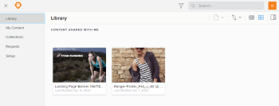

# Get started with `Workfront Library`

`Workfront Library` is designed to be your organization's digital content hub, allowing you to manage the full lifecycle of your organization's digital content.

You can use `Workfront Library` in conjunction with the workflows you have in Workfront to seamlessly manage all your assignments and to get your work done.

## Access to `Workfront Library`

To access `Workfront Library`, you need the following:

* A user profile in `Workfront Library`
* A `Workfront Library` access level

As a Workfront user, you are not automatically given access to your organization's instance of `Workfront Library`. You must be granted access by your `Workfront Library administrator` who assigns you an access level.

There are 3 access levels available, with each level allowing the user to perform specific activities in `Workfront Library`:

* `Admin`: Allows the user full access to everything in `Workfront Library`. For more information on Admin tasks, see [Administration and setup of Workfront Library](../../../workfront-library/administration-and-setup/administration-and-setup-library.md). 

* `Manager`: Allows the user to upload, edit, and share items in `Workfront Library` and to any portal to which they have been given Manage permission. For more information on Manager tasks, see [Content management in Workfront Library](../../../workfront-library/content-management/content-management.md).

* `Viewer`: Allows the user to see and download items to which they have View permission. For information on Viewer tasks, see [Workfront Library Basics](../../../workfront-library/content-management/basics/basics.md).

For more information about access levels, see [Overview of user access to Workfront Library](../../../workfront-library/administration-and-setup/user-access/user-access-overview.md)

Each access level includes specific permissions that define what users can do with content to which they have access. &nbsp;For information on permissions, see [Permissions in Workfront Library](../../../workfront-library/administration-and-setup/user-access/permissions-in-workfront-library.md).

Your `Workfront Library` access level allows you to open `Workfront Library`; however, it does not give you access to all the content stored in Workfront Library. You can only access content that has been shared with you or that you have uploaded to Workfront Library. For more information on sharing content, see [Share a Workfront Library item with other users](../../../workfront-library/content-management/share-an-asset-with-users.md).

If you have Manager or higher access to `Workfront Library`, you can upload content to `Workfront Library` and share it with other users. For information on uploading content, see [Upload content to Workfront Library](../../../workfront-library/content-management/upload-new-content.md).

## Tour of `Workfront Library`

Once you have your assigned access level, you can open `Workfront Library` from Workfront. Click the `Workfront Library` icon in the upper-right corner of the Global Navigation Bar.
In Workfront, click the Main Menu icon , then select Library to open Workfront Library in a new browser tab. 

Depending on your access level, you can access the following areas of `Workfront Library`:

* [Library area](#library) 
* [My Content area](#my) 
* [Collections area](#collecti)

Each area displays the content that you have access to. Your `Workfront Library` access level and the permissions that you have to each item determine what you can do with the content available to you. For more information, see [Permissions in Workfront Library](../../../workfront-library/administration-and-setup/user-access/permissions-in-workfront-library.md).

You can sort and filter the items that display in the area, and you can search for specific content within the active area. For more information, see the following:

* [Search for items in Workfront Library](../../../workfront-library/content-management/basics/search-for-items-in-workfront-library.md) 
* [Sort content in Workfront Library](../../../workfront-library/content-management/basics/sort-content-in-library.md)

### Library area

When you open `Workfront Library` you land in the Library area, which contains all the content, folders, and collections shared with you.

Depending on your access level and permissions you have to each item, you might be able manage, share, and download the content in your Library area. Users with Viewer access to `Workfront Library` can only view and download items in their Library area.

### My Content area

If you have Manager or higher access to `Workfront Library`, you can open My Content. Any content that you upload or folders that you create display in your My Content area.

From your My Content area you can manage, share, and download the content. You can also create folders and upload new content.

### Collections area

The Collections area displays the collections that you create and any collections shared with you. A collection consists of related content and folders.

If you have Manager or higher access to `Workfront Library`, you can share a collection with other users. For more information on collections, see [Share a Workfront Library item with other users](../../../workfront-library/content-management/share-an-asset-with-users.md).
