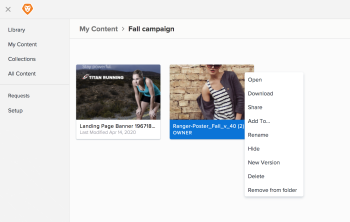

# Remove an asset from a folder

If you have manage access to an asset, you can remove it from a folder.

<ol> 
 <li value="1"> <draft-comment>
   
In <em>Workfront</em>, click the Main Menu icon , then select Library to open <em>Workfront Library</em> in a new browser tab.

  </draft-comment>
In <em>Workfront</em>, click the Main Menu icon , then select Library to open <em>Workfront Library</em> in a new browser tab.
 </li> 
 <li value="2">In either the Library or My Content area, find the folder and double click to open it.</li> 
 <li value="3">Find the asset you want to remove, then right click and select Remove from folder. </li> 
 <li value="4"> 
In the dialog box, click Remove.
 <note type="note">
   If the asset exists in one place, removing from the folder also removes it from the Library. 
  </note> </li> 
</ol>

