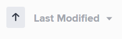

# Sort content in *`Workfront Library`* {#sort-content-in-workfront-library}

You can sort the items that display in an area in *`Workfront Library`*. You can sort only similar types of items. For example, when you sort content, all the content in the active area is sorted together. Folders are sorted together, separately from content. In the Collections area, collections in the My Collections section are sorted together, separately from the collections in the Collections Shared with Me section. 

When you sort items in *`Workfront Library`*, you sort only your instance of *`Workfront Library`*. 

1.  In *`Workfront`*, click the `Main Menu` icon , then select `Library` to open *`Workfront Library`* in a new browser tab.
1.  In the upper-left corner of *`Workfront Library`*, click the `Menu` icon .
1.  Select the area you want to sort.

    
    
    * Users with Manager or higher access to *`Workfront Library`* can sort the items in My Content, Library, or Collections areas. 
    * Users with Viewer access can sort their Library and Collections areas.
    
    

1.  Click the `Sort` drop-down arrow icon .
1.  Select the sort criterion.

   You can choose from the following criteria:

    
    
    * `Name:` Sorts each type of item alphabetically by name. For example, content files are sorted by file name.
    * `Last Modified:` Sorts each type of item by the following date: 
    
    
    
    

    
    
    

1.  Click the sort arrows to select the desired sort order.

   

   The Up arrow sorts in ascending order, while the down arrow sorts in descending order.

