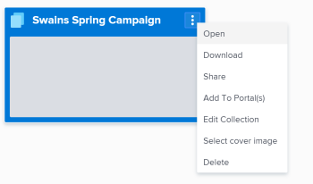

# Change the cover image on an item in Workfront Library

If you have Manage permissions to a folder or a collection, you can change the image that displays on its cover with an image of an item to which you have access.

When you change the cover image, it is changed for all users who have access to the folder or collection.

<ol> 
 <li value="1"> In Workfront, click the Main Menu icon , then select Library to open Workfront Library in a new browser tab. </li> 
 <li value="2"> 
In the upper-left corner of Workfront Library, click the Menu icon.
 </li> 
 <li value="3"> 
Navigate to the folder or collection that you want to change, hover over it and click the More icon in the upper-right corner.
 </li> 
 <li value="4"> 
Select Select cover image in the drop-down menu.
 
  
 </li> 
 <li value="5"> 
Navigate to the image you want displayed as the cover image.
 
You can choose any asset thumbnails in your Library, My Content, or Collections areas. You cannot use an expired or hidden item as a cover image. 
 </li> 
 <li value="6"> 
&nbsp;Select the image, then click Save.
 
The new image displays on the cover of the folder.
 
The cover image you select remains as the cover image, even if the asset is updated with a new version or is deleted from Workfront Library.
 </li> 
</ol>

