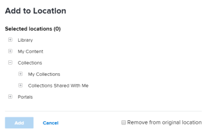
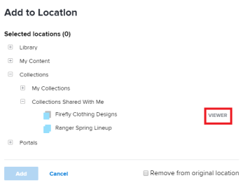

# Add items to a collection in *Workfront Library*

You can add content and folders to a collection that you create or that has been shared with you. When you add content to a collection, the content remains in its original location, and you simply create a link to the content file.

<ol> 
 <li value="1"> 
In the upper-left corner of <em>Workfront Library</em>, click the Menu icon .
 </li> 
 <li value="2"> 
Select the area where the item you want to add is located.
 
If you have Manager or higher access to <em>Workfront Library</em>, you can choose content from either your Library or My Content areas. Users with Viewer access can select items from their Library area.
 </li> 
 <li value="3"> 
(Conditional) If you are in the list view, click the Show grid view icon  to switch to the grid view.
 </li> 
 <li value="4"> 
Hover over the item you want to add, then click the More icon in the upper-right corner of the item.
 </li> 
 <li value="5"> 
Select Add to in the drop-down menu.
 
  
 </li> 
 <li value="6"> 
Click the plus sign next to Collections to display the collections available to you.
 
  
 
Depending on the collections you have access to, you might have the following Collection options:
 
  <ul> 
   <li>My Collections: Contains collections that you have created. For information on creating a collection, see <a href="../../../workfront-library/content-management/collections/create-a-collection.md" class="MCXref xref">Create a collection in Workfront Library</a>.</li> 
   <li> 
Collections Shared with Me: Contains collections that have been share with you by other users. Users with Viewer access to <em>Workfront Library</em> can add items only to collections that they have created. Users with Manager access and with View permissions to a collection shared with them cannot add items to the collection. 
 
You can hover over a shared collection listed to view your permissions level.
 
  
 
For information on access levels and permissions, see <a href="../../../workfront-library/administration-and-setup/user-access/user-access-overview.md" class="MCXref xref">Overview of user access to Workfront Library</a>
 </li> 
  </ul> </li> 
 <li value="7"> 
(Optional) Click Remove from original location to remove the item from where you accessed it in Step 3.
 
Only users with Manage permissions to the item can remove it from its original location.
 </li> 
 <li value="8">Click Add.</li> 
</ol>

