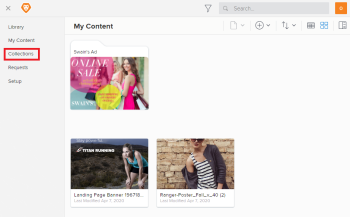
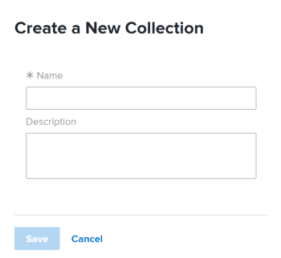

# Edit a `Workfront Library` collection

You can make the following changes to a collection that you have Manage access to:

* Name of the collection
* Description
* Cover image

`<li> In Workfront, click the Main Menu icon , then select Library to open Workfront Library in a new browser tab. </li>` For information on changing a collection's cover image, see [Change the cover image on an item in Workfront Library](../../../workfront-library/content-management/change-cover-image-of-folder.md).

When you edit a collection that is shared with other users in `Workfront Library`, the collection's name is automatically updated in all the shared instances. Users are not notified of edits made to a collection.

<ol> 
 <li value="1"> 
In the upper-left corner of Workfront Library, click the Menu icon .
 </li> 
 <li value="2"> 
Click Collections in the left panel.
 
  
 </li> 
 <li value="3"> 
Click New Collection in the upper-left corner.
 
  
 </li> 
 <li value="4">In the Name box, type a name for the collection.</li> 
 <li value="5"> 
(Optional) In the Description box, type a description of the collection.
 </li> 
 <li value="6"> 
Click Save.
 </li> 
</ol>

