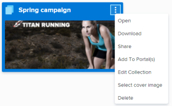

# Open a collection in *Workfront Library*

The Collections area in *Workfront Library* allows you to view and open all the collections that you have access to.

<ol> 
 <li value="1"> <draft-comment>
   
In <em>Workfront</em>, click the Main Menu icon , then select Library to open <em>Workfront Library</em> in a new browser tab.

  </draft-comment>
In <em>Workfront</em>, click the Main Menu icon , then select Library to open <em>Workfront Library</em> in a new browser tab.
 </li> 
 <li value="2"> 
In the upper-left corner of <em>Workfront Library</em>, click the Menu icon .
 </li> 
 <li value="3"> 
Select Collections.
 
The Collections area opens.
 
  
 
Depending on the collections you have access to, you might see the following collection categories:
 
  <ul> 
   <li>My Collections: Contains collections that you have created. For information on creating a collection, see <a href="../../../workfront-library/content-management/collections/create-a-collection.md" class="MCXref xref">Create a collection in Workfront Library</a>.</li> 
   <li>Collections Shared with Me: Contains collections that other users have shared with you. For information on sharing a collection, see <a href="../../../workfront-library/content-management/share-an-asset-with-users.md" class="MCXref xref">Share a Workfront Library item with other users</a>.</li> 
  </ul> </li> 
 <li value="4"> 
Hover over the collection you want to open, click the More icon in the upper-right corner, then click Open.
 
  
 
The collection opens. You can filter, sort, and search the contents. For more information, see the following articles:
 
  <ul> 
   <li><a href="../../../workfront-library/content-management/basics/filter-content-displayed.md" class="MCXref xref">Filter content displayed in Workfront Library</a> </li> 
   <li><a href="../../../workfront-library/content-management/basics/sort-content-in-library.md" class="MCXref xref">Sort content in Workfront Library</a> </li> 
   <li><a href="../../../workfront-library/content-management/basics/search-for-items-in-workfront-library.md" class="MCXref xref">Search for items in Workfront Library</a> </li> 
  </ul> </li> 
</ol>

