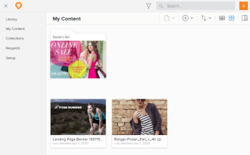

# Access older versions of content in `Workfront Library`

As a user with Manage permission to content, you can use `Workfront Library` to view and download all iterations of content through the versioning feature.&nbsp;For more on managing versioning content, see [Overview of content versioning in Workfront Library](../../../workfront-library/content-management/content-versioning/content-versioning-overview.md).

In `Workfront Library`, the active (or current) version of content is packaged together with its older versions. In order to access an older version of content, you must first open the active version.

You cannot search for an older version of content. Instead, you must search for the name of the active version. Once you have the active version open, you access the older versions.

Users with View permission to content can view only the active version.

<ol> 
 <li value="1"> In Workfront, click the Main Menu icon , then select Library to open Workfront Library in a new browser tab. </li> 
 <li value="2"> 
In the upper-left corner of Workfront Library, click the Menu icon .
 </li> 
 <li value="3"> 
Select the area where the active version is located.
 
You can choose Library, My Content , or Collections.
 
  
 </li> 
 <li value="4">Navigate to the thumbnail for the active content.</li> 
 <li value="5"> 
Hover over the thumbnail, click the More icon in the upper-right corner of the thumbnail, then select Open in the drop-down menu.
 
The active version of the content opens.
 </li> 
 <li value="6"> 
Click the Version drop-down arrow following the content title, then select the version that you want to view.
 
For information on downloading older version of content, see <a href="../../../workfront-library/content-management/basics/download-content-from-library.md" class="MCXref xref">Download items from Workfront Library</a>.
 </li> 
</ol>

