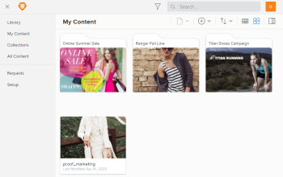

# Create and manage views in Workfront Library {#create-and-manage-views-in-workfront-library}

## Views in *`Workfront Library`* {#views-in-workfront-library}

Workfront Library allows you to select the view you want to use, so that the information you need is readily available. There are two types of views:

* `Grid view` `:` The default view, which shows thumbnails of your *`Workfront Library`* assets. To switch to grid view, click the `Show grid view` icon .

* `List view` `:` Allows you to see more details about your library assets at a glance. You can save customized list views, as well as export asset metadata from the list view. To switch to the list view, click the `Show list view` icon .

## Create a custom list view {#create-a-custom-list-view}

You can customize a list view to show the metadata you choose and save it for later viewing. Saved list views save a specific arrangement of columns for a specific set of assets.

To create a custom list view:

1.  In the upper-left corner of *`Workfront Library`*, click the `Menu` icon .
1.  Select the area where the assets you want to view are located.

   

1.  (Conditional) If you are in the grid view, click the `Show List View` icon  to switch to list view.

   

1. Do any of the following:
    
    
    * Filter for the items you want to display. For more information, see [Filter content displayed in Workfront Library](filter-content-displayed.md).
    * Select the columns you want to display by clicking the `Toggle Columns` icon  and selecting your columns from the drop-down list. The available columns are based on the metadata available for your assets. The columns will appear in the order they are in the list, and the order cannot be changed.
    
    * Modify the column width by moving your mouse to the header row, hovering over the border of the column you want to resize, and dragging the border to resize the column.
    
    
1. To save this view, click the `Saved views` icon , type a name into the `New view name` field in the drop-down menu, and click `Saved view`.

## Return to a saved list view {#return-to-a-saved-list-view}

1. (Conditional) If you are in the grid view, click the `Show List View` icon  to switch to list view.

1. Click the `Saved views` icon .

1. Select the desired saved view from the drop-down menu.

&nbsp;
