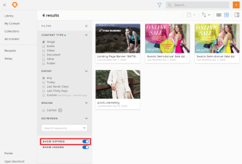

# Filter for expired content in Workfront Library

Depending on how your Workfront Library administrator setup the Expiration feature, you might be able to view expired content by enabling the Show Expired filter. For more information on expired content, see [Set up content expiration in Workfront Library](../../../workfront-library/administration-and-setup/workfront-library-setup/set-up-content-expiration-in-library.md).

<ol> 
 <li value="1"> In Workfront, click the Main Menu icon , then select Library to open Workfront Library in a new browser tab. </li> 
 <li value="2"> 
Click the Filter icon. 
 <note type="tip">
   Depending on the view you have activated, the name displayed on the Content View drop-down menu can be either Name, Relevant, or Last Modified.
  </note> </li> 
 <li value="3"> 
In the Filter menu, enable the Show Expired toggle.
 
  
 
You can now view expired content. The Show Expired filter affects only your instance of Workfront Library and does not make expired items visible for other users.
 </li> 
</ol>

