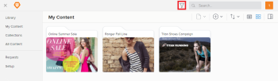

# Filter for hidden content in *Workfront Library*

As a user with Manager or higher access to *Workfront Library*, you can enable a filter to display hidden content to which you have Manage permission. Users with Viewer access to Workfront Library cannot view hidden content.

This filter affects only your instance of *Workfront Library* and does not make hidden items visible for other users.

<ol> 
 <li value="1"> <draft-comment>
   
In <em>Workfront</em>, click the Main Menu icon , then select Library to open <em>Workfront Library</em> in a new browser tab.

  </draft-comment>
In <em>Workfront</em>, click the Main Menu icon , then select Library to open <em>Workfront Library</em> in a new browser tab.
 </li> 
 <li value="2"> 
Click the Filter icon. 
 <note type="tip">
   Depending on the view you have activated, the name displayed on the Content View drop-down menu could be either Name, Relevant, or Last Modified.
  </note> </li> 
 <li value="3"> 
In the Filter menu, enable the Show Hidden toggle.
 
  
 
You can now view hidden content. The Show Hidden filter affects only your instance of <em>Workfront Library</em> and does not make hidden items visible for other users.
 </li> 
</ol>

