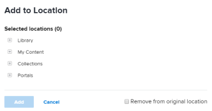

# Add items to a folder in *Workfront Library*

You can add folders and content to any folder that you create or to a folder that has been shared with you. When you use the Add To feature to add items to a folder, you don't actually add the item to the folder. Instead, you add a link to the item. The item remains in its original location.

<ol> 
 <li value="1"> <draft-comment>
   
In <em>Workfront</em>, click the Main Menu icon , then select Library to open <em>Workfront Library</em> in a new browser tab.

  </draft-comment>
In <em>Workfront</em>, click the Main Menu icon , then select Library to open <em>Workfront Library</em> in a new browser tab.
 </li> 
 <li value="2"> 
In the upper-left corner of <em>Workfront Library</em>, click the Menu icon .
 </li> 
 <li value="3"> 
Select the area where the item you want to add is located.
 
If you have Manager or higher access to <em>Workfront Library</em>, you can choose content from either your Library or My Content areas. Users with Viewer access can select items from their Library area.
 </li> 
 <li value="4"> 
(Conditional) If you are in the list view, click the Show grid view icon  to switch to the grid view.
 </li> 
 <li value="5"> 
Hover over the item you want to add, click the More icon in the upper-right corner, then select Add to in the drop-down menu.
 
The Add to location dialog box opens.
 
  
 </li> 
 <li value="6"> 
Click the plus sign next to the location where the folder is stored.
 
(Optional) Continue to open folders until you locate the folder in which you want to add the item.
 </li> 
 <li value="7"> 
(Optional) Click Remove from original location to remove the item from where you accessed it in Step 4.
 
Only users with Manage permissions to the item can remove it from its original location. 
 </li> 
 <li value="8">Click Add.</li> 
</ol>

