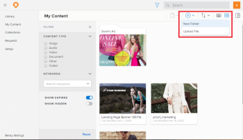

# Create a folder in *Workfront Library*

If you have Manager or higher access to *Workfront Library* you can create folders to organize content. By nesting folders, you can create a folder structure that makes finding content quick and easy.

When you create a folder, you have the option to select the image you want as the folder cover image. If you don't select a cover image, the folder thumbnail is gray as long as the folder remains empty. When you upload content to the folder, *Workfront Library* randomly selects a cover image from the files uploaded to the folder. If a folder contains only subfolders, the cover remains gray.

For information on changing the cover image, see [Change the cover image on an item in Workfront Library](../../../workfront-library/content-management/change-cover-image-of-folder.md).

Users with Manager or high access can create an unlimited number of folders. Users with Viewer access cannot create folders.

&nbsp;For more information about folders, see [Overview of folders in Workfront Library](../../../workfront-library/content-management/folders/folders-overview-library.md).

<ol> 
 <li value="1"> <draft-comment>
   
In <em>Workfront</em>, click the Main Menu icon , then select Library to open <em>Workfront Library</em> in a new browser tab.

  </draft-comment>
In <em>Workfront</em>, click the Main Menu icon , then select Library to open <em>Workfront Library</em> in a new browser tab.
 </li> 
 <li value="2"> 
In the upper-left corner of <em>Workfront Library</em>, click the Menu icon .
 </li> 
 <li value="3"> 
Navigate to where you want to add a folder.
 
You can add a folder to your Library or My Content areas and to any collection that you have access to. You can also create sub-folders within an existing folder.
 </li> 
 <li value="4"> 
(Conditional) If you are in the list view, click the Show grid view icon  to switch to the grid view.
 </li> 
 <li value="5"> 
Click the Add New icon  in the upper-right corner, then select New Folder.
 
  
 </li> 
 <li value="6"> 
Type a name for the folder, then press Enter.
 
When you navigate to another area of <em>Workfront Library</em>, the newly-created folder is placed in alphabetical order with the other folders in the area.
 </li> 
 <li value="7">(Optional) Select a cover image for the folder:
  <ol>
   <li value="1">
Hover over the folder you just created, click the More icon in the upper-right corner of the folder, then click Select cover image in the drop-down menu.
</li>
   <li value="2">
Navigate to the image you want displayed on the folder cover.

You can choose from content in your Library or My Content areas. You cannot use an expired or hidden item as a cover image.
<note type="note">
     The image you select remains as the cover image, even if the asset is updated with a new version or is deleted from 
     <em>Workfront Library</em>. 
    </note></li>
   <li value="3">
Select the image, then click Save.

The image displays on the folder cover. You might need to refresh your browser tab to see the folder cover.
</li>
  </ol></li> 
</ol>

You can now add content and folders to the folder you just created. For more information, see [Add items to a folder in Workfront Library](../../../workfront-library/content-management/folders/add-items-to-a-folder-library.md).
