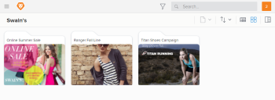

# Overview of *Workfront Library* portals

Your organization can portals to gather, share, and manage related content while providing a branding experience for internal and external users. One of the advantages of using a portal is that you can distribute specific assets to users without giving them access to *Workfront Library*.

As a *Workfront Library administrator* or a user with Manager access to the portal, you can give someone access to a portal and assign them one of the following portal access levels:

* `Manager`: User can add, edit, download, and share items in the portal
* `Viewer:` User can see and download items in the portal

>[!NOTE]
>
>* A user must have a Workfront profile in order to be eligible for access to a portal. For information on creating a user profile in Workfront, see [Add users](../../../administration-and-setup/add-users/create-and-manage-users/add-users.md).
>* Users who are *Workfront Library administrators* are automatically given Admin access to a portal.
>

Access levels not only allow users to open the portal, they also determine the highest permissions users have to items in the portal.&nbsp;If a user has access to *Workfront Library*, their portal access level can be different than their *Workfront Library* access level. A user's highest level of access to an asset, whether in Workfront Library or in a portal, determines the activities that user can perform on the asset.

You can use access levels to manage the activities users can perform on assets. For example, portal users who don't have access to *Workfront Library* and who have Viewer access to a portal can only view and download content in the portal. Users with Manager access to content in a portal have permissions that allow them to make changes to items in the portal. Even if the portal user does not have access to *Workfront Library*, if they have Manager access to a portal, they can make changes to content in Workfront Library.

Consider the following example:

* Joan Harris has Viewer access to *Workfront Library*.

  * She has View permissions to the Ranger_Print-Ad2 file in *Workfront Library*.

* She has Manager access to the Ranger portal.

  * She has Manage permissions to the Ranger_Print-Ad2 file in the portal.
  * She renames the Ranger_Print-Ad2 file in the portal to Campaign_Cover.
  * The Ranger_Print-Ad2 file in *Workfront Library* is updated with file name Joan applied in the portal.

Although Joan has only View permissions to the file in *Workfront Library*, she is able to edit the file in the portal using her portal Manage permissions.

Because each item in a portal is actually a link to its counterpart in Workfront library, any changes made to an item in a portal affect the actual item in *Workfront Library*. Conversely, changes made to an item in *Workfront Library* affect all instances of the item, including in portals.

There are 2 ways you can give users access to *Workfront Library*:

* `Explicit access`: Access you specifically assign to a user when you add them to a portal
* `Inherited access`: Access inherited by a user who is a member of a *Workfront* organizational unit that you've given access

For information on granting users portal access, see [Give users access to a Workfront Library portal](../../../workfront-library/administration-and-setup/user-access/give-users-access-portal.md).

When you first give a user access, *Workfront Library* sends the user an email invitation with a link that opens the portal. For information on inviting users to a portal, see [Give users access to a Workfront Library portal](../../../workfront-library/administration-and-setup/user-access/give-users-access-portal.md).

After their first visit to the portal, users can access the portal through *Workfront Library* or from a browser using the portal's URL. For information on opening a portal, see .

Once in the portal, users can access the portal's assets, folders, and collections. To add content to a portal you must meet the following criteria:

* Have Manage permissions to the content, folder, or collection that you want to add
* Have Manager or higher access to the portal to which you want to add items

Only portal users with Manage access can see hidden or expired content using filters. For information on using filters, see [Filter content displayed in Workfront Library](../../../workfront-library/content-management/basics/filter-content-displayed.md).
