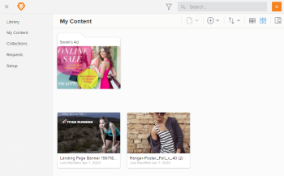

# Share a *`Workfront Library`* item with other users {#share-a-workfront-library-item-with-other-users}

## Understand sharing items {#understand-sharing-items}

If you have Manage permission to a *`Workfront Library`* item, you can share it with other users and organizational units in *`Workfront Library`* and with external users. 

You can share the following *`Workfront Library`* items:

* [Content](#share) 
* [Folder](#folder) 
* [Collection](#collecti) 

When you share a *`Workfront Library`* item with internal users, *`Workfront`* informs them of the shared item through an in-app notification. 

You can share an item with an external user by emailing them a link to the item, which allows them download the item. External users do not need a Workfront login to access items you share with them. 

Items that have been shared with internal users display the Shared icon.

### Content {#content}

When you share content that has multiple versions, you share a content package that contains all the versions. Users with View permission to the shared content can view only the active (or current) version of the asset, while users with Manage permission can view and download the active version, as well as older versions of content. For information on content versioning, see [Overview of content versioning in Workfront Library](content-versioning-overview.md).

### Folder {#folder}

When you share a folder with another user, that user automatically inherits access to all the assets and sub-folders within the folder. For example, if you grant a user Manage permission to a folder, then that user has Manage permission to all the items contained within the folder and any of its sub-folders. For more information about folders, see [Overview of folders in Workfront Library](folders-overview-library.md).

### Collection {#collection}

When you share a collection with another user, that user automatically inherits access to all the assets, folders, and sub-folders contained within the collection. For example, if you grant a user Manage permission to a collection, then that user has Manage permission to all the items contained within the collection. For more information on collections, see [Edit a Workfront Library collection](edit-a-collection.md).

## Specify users' permissions for shared items {#specify-users-permissions-for-shared-items}

When you share an item with other users, you give them access and permissions that allow them to use and manage that item. For more information on access and permissions, see [Permissions in Workfront Library](permissions-in-workfront-library.md).

You cannot give a user permissions to an item that exceeds their *`Workfront Library`* access level. For example, if a user has Viewer access to *`Workfront Library`*, that user cannot be given Manage permissions to an item. For more information on access levels, see [Overview of user access to Workfront Library](user-access-overview.md).

## Share a *`Workfront Library`* item  {#share-a-workfront-library-item}

1.  In *`Workfront`*, click the `Main Menu` icon , then select `Library` to open *`Workfront Library`* in a new browser tab.
1.  In the upper-left corner of *`Workfront Library`*, click the `Menu` icon .
1.  Select the area where the item you want to share is located.

   You can choose Library, My Content , or Collections.

   

1.  (Conditional) If you are in the list view, click the `Show grid view` icon  to switch to the grid view.
1. Navigate to the item and hover, then click the `More` icon in the upper-right corner.
1.  Select `Share` in the drop-down menu.

   The Share dialog displays.

   The Share dialog shows only the *`Workfront Library`* users and organizational units that you have shared the item with. 

   >[!NOTE]
   >
   >The Share dialog shows only the *`Workfront Library`* users and organizational units that you have shared the item with. 

1.  In the `Give access to` box, begin typing the name of the *`Workfront Library`* user or organizational unit that you want to share the item with, then click the name when it displays in the drop-down list. 

   The user displays in the list and is, by default, given View permission to the item.

   >[!TIP] {type="tip"}
   >
   >If a user has a Manager or higher access level to *`Workfront Library`*, you can choose to increase their permission level to Manage. 

1.  (Optional) To change a user's permissions to the shared content, click the permissions level drop-down menu arrow, then select the desired permission.

   

   If a user with whom you want to share the content does not have an permissions level drop-down menu arrow, then you cannot increase their permissions. For more information on access to shared items, see [Specify users' permissions for shared items](#specifyi).

1.  (Optional) To share the item with an external user:

    
    
    1. Enable `Make this public to external users`.
    1. Click `Copy Link`.
    1. Paste the link in a third-party tool such as a chat or email application, then distribute to the user.
    
    

1. Click `Save`.

