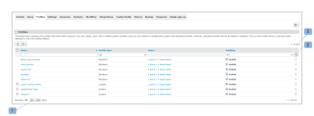

# Configure custom profiles in `Workfront Proof`

>[!IMPORTANT]
>
>This article refers to functionality in the standalone product `Workfront Proof`. For information on proofing inside `Adobe Workfront`, see [Proofing](../../../review-and-approve-work/proofing/proofing.md).

As a `Workfront Proof` Billing Administrator or `Workfront Proof` Administrator, you can configure custom profiles for other users.

Custom profiles allow you to assign granular permissions to users in your account and define the level of access and rights they have over the items in your account. For more information about custom profiles, see [Create and Manage Custom Profiles using Workfront Proof](../../../workfront-proof/wp-mnguserscontacts/users/create-and-manage-custom-profiles.md).

You can adjust the layout of the page to view only the information relevant to you:

<ul> 
 <li>You can adjust the number of items displayed (1)</li> 
 <li>You can filter the list of profiles to locate the ones you want to work with (2)</li> 
 <li>You can easily check the number of profiles you have in the account (3) </li> 
</ul>

## Profiles Tab

The Profiles tab lets you conveniently add and manage custom profiles. From here you can perform the following actions:

* Add a new profile (1)
* Perform bulk actions on profiles:
* Delete multiple profiles (2)
* Disable multiple profiles (3)
* Enable multiple profiles (4)
* Access profile details (5)
* Copy a profile (6)
* Disable a profile (7)

For additional information on how to customize the Profiles tab, see [Create and Manage Custom Profiles using Workfront Proof](../../../workfront-proof/wp-mnguserscontacts/users/create-and-manage-custom-profiles.md).

## Profile Details

The Profile Details page allows you to modify the permissions enabled for your custom profile, copy the profile, delete&nbsp;the profile, and view the list of users to whom the profile is assigned.

For more information on the actions you can perform on this page, see " [Create and Manage Custom Profiles using Workfront Proof](../../../workfront-proof/wp-mnguserscontacts/users/create-and-manage-custom-profiles.md).&nbsp;

* [Accessing the Profile Details Page](#accessing-profile-details) 
* [Viewing the List of Users with a Profile Assigned](#list-of-users-with-a-profile-assigned)

### Accessing the Profile Details Page

To access the profile details:

<ol> 
 <li value="1">Click on the name of the profile.</li> 
 
  
 
</ol>

### Viewing the List of Users with a Profile Assigned

To view the list of users who have been assigned a particular profile:

<ol> 
 <li value="1">Click on the link showing the number of active and deactivated users with this profile (1).</li> 
 
Alternatively, this list is displayed on the Profile details page.
 
 
  
 
 
The list shows you both active and deactivated users in your account that have been assigned the profile in question. If your list is too long, you can conveniently adjust the layout of the page to view only the information you are looking for. 
 
 
  
 
</ol>

