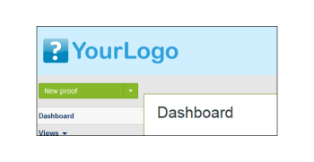
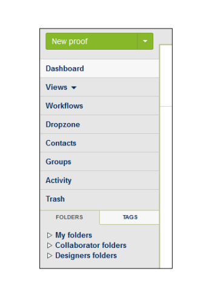
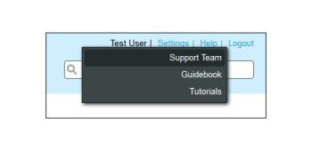

# Brand the `Workfront Proof` site - advanced

>[!IMPORTANT]
>
>This article refers to functionality in the standalone product `Workfront Proof`. For information on proofing inside `Adobe Workfront`, see [Proofing](../../../review-and-approve-work/proofing/proofing.md).

Advanced branding is available on Select and Premium plans and is included in the cost of the plan.

For information about basic branding, which includes the login page, email notifications, and `proofs`, see&nbsp; [Brand the Workfront Proof site](../../../workfront-proof/wp-acct-admin/branding/brand-wp-site.md).

Advanced branding options include customization of the following areas:

* Header and text color
* Web application header
* Menu bar and text color
* Dashboard welcome box and quickstart box
* Footer text
* Favicon
* Page title
* Help links

The following sections describe advanced branding in more detail:

## Advanced Branding Overview

You'll find the Branding configuration section&nbsp;in the [Configure proof settings for your organization](../../../administration-and-setup/manage-workfront/configure-proofing/configure-proofing-organization.md) tab of your [Account Settings](https://support.workfront.com/hc/en-us/sections/115000912147-Account-Settings) page. To apply the changes to your account make sure that Branding option is set to Enabled (1).  

Please see the section below for more detailed information on how to configure the Advanced branding options (2-14).

## Advanced Branding Configuration

You can brand the following areas of `Workfront Proof`:

* [Web Application](#web-application) 
* [Header](#header) 
* [Header Links](#header-links) 
* [Sidebar](#sidebar) 
* [Welcome Box](#welcome-box) 
* [Section Headers](#section-headers)

### Web Application

You have a choice of three branding options for the web application header (2):

* Branding image in the header
* Your account name in the header
* If you disable branding the `Workfront Proof` logo will remain in the header of the web app

Branding image - resizes to a maximum size of&nbsp;550x90px. You can use JPGs, GIFs or PNGs, and the transparent backgrounds are supported.

Account name - taken from your account details and displayed using&nbsp;white font. Your account name can have up to 60 characters (including spaces and punctuation marks).

### Header

In this field (3)&nbsp;you can set the header's background and you can choose a solid color or a background image.

Color -&nbsp;here, as in all other branding fields of the color scheme configuration you can either enter a Hex color value of your choice or use a handy color picker (clicking the text field opens the pop-up).&nbsp;The default header background color is #232d2e.

Background image - can be combined together with the Branding image.

* You can use JPGs, GIFs or PNGs&nbsp;- for the files with transparency a white background color displays.
* Header's height is 96px and the uploaded image will not be resized for the No repeat option.
* Background image is positioned to the top left.

### Header Links

In this field (4) you can modify the user name color and color of the links in the Header menu visible in the top right corner of your account.  

### Sidebar

Choose colors for the Menu bar (5) and Menu font (6) to customize your Sidebar

>[!NOTE]
>
>&nbsp;Hover color adjusts automatically by adding a constant Hex&nbsp;value to your selected Menu bar color.

The New `proof` button color cannot be customized.

### Welcome Box

In this field (7)&nbsp;you can set the Welcome box color that is displayed on the Dashboard page.  

### Section Headers

These fields allow you to customize the&nbsp;background (8) and the font color (9) of the section headers on the [Account Settings](https://support.workfront.com/hc/en-us/sections/115000912147-Account-Settings) pages.  

`Footer`

In this field (10) of Branding configuration&nbsp;you can compose a footer that will be displayed at the bottom of all the account pages. You can use the built-in WYSIWYG editor or you can simply paste your own design.  

>[!NOTE]
>
>&nbsp;You can't edit HTML in the footer text editor, but you can paste a copied design (including all the links and images).

`Favicon and Page title`

You can customize how your `Workfront Proof` pages are presented in the browsers by setting your own favicon image (.ICO file) (11) and Page title (12) - these will be displayed&nbsp;in the browsers' tabs/windows headers for all the account pages.  

>[!NOTE]
>
>Your favicon will be displayed also in the headers of the `Workfront Proof` Viewer windows for all the `proofs` created on your account.

`Help links`

You can customize your own help links to point your users and reviewers to your own content. To activate this set the Help links option (13) to Enabled and add your links in the next fields (14). You can configure up to four&nbsp;links, and they will be available:

<ul> 
 <li>in the Header menu under the Help link </li> 
 <li>in the Help panel of the Workfront Proof Viewer sidebar </li> 
</ul>

For an additional charge, customers on Enterprise plans also have the option to fully customize the following:

* Fully customize your landing pages (e.g. login and logout pages, forgot password page)
* Fully customize your domain

Please contact us at sales.team@workfront.com to find out more about the additional branding options.

<!--
Custom Domains
-->

<!--
Our Select and Premium plans include the option to purchase a fully-branded domain. This means that you can customize your URL as well as all links included in notification emails.
-->

<!--
For more information, please see Configure a branded domain in Workfront Proof.
-->

<!--
Custom Page Branding
-->

<!--
Custom branding of the Workfront Proof pages is a paid service and by default includes full customization of the following:
-->

  <!--
  Log in/landing page
  -->

  <!--
  Logout page
  -->

  <!--
  Forgot password page
  -->

<!--
Design Elements
-->

<!--
Please create your design in a .PSD file with all the elements placed in the separate layers - this will allow us to prepare the scalable pages for you.
-->

<!--
There are no particular restrictions on the .PSD files, and the look and layout of the pages is completely up to you. However please make sure that the key elements are included in your design:
-->

<!--
Login Page
-->

<!--
Logout page
-->

<!--
Forgot password
-->

<!--
Inactivity alert
-->

<!--
Invalid email address
-->

<!--
Inactivity and incorrect email address
-->

<!--
Note: The separate designs for the alerts are not required. If you’d like us to leave the default style of the messages, as shown on the screencasts above, please let us know. The team will match the colors with your design.
-->

<!--
If you'd like to have placeholder text in the text fields, please include this in your designs.
-->

<!--
Note: The wording of the alerts cannot be changed as these are the system messages.
-->

<!--
2. Fonts
-->

<!--
Please make sure that the text is not rasterized but kept as the text layers, unless you want the particular elements to be displayed as images on your landing pages.
-->

<!--
If you use custom fonts in your design, please make sure to include the following font files: EOT + .TTF + OTF + SVG + WOFF for support in all browsers.
-->

<!--
Note: You need to hold an appropriate license, which allows implementing your selected fonts on the web pages.
-->

<!--
If you use the standard and widely available fonts, the font files are not required. Please see the following lists for reference:
-->

  <!--
  Websafe fonts listed in the standard Font families
  -->

  <!--
  Open Source Google fonts
  -->

<!--
3. Screen resolution
-->

<!--
We support 1024x768 screen resolution (1366x768 for wide screens) and upwards. However, for the landing pages designs we do recommend using higher resolution for the better results on the various screens. The best practice would be to determine what screen resolution is the most common on your users’ machines and prepare a slightly bigger design.
-->

<!--
4. Browsers compatibility
-->

<!--
The newer browsers generally don’t require any custom code to display the pages properly. However, if your users have the older browser versions installed on their machines some code adjustments may be needed.
-->

<!--
By default we do prepare the pages compatible with the following browsers:
-->

  <!--
  Internet Explorer 9+
  -->

  <!--
  Safari 6.x+
  -->

  <!--
  Chrome 22+ *
  -->

  <!--
  Firefox 15+ *
  -->

<!--
* Preferred browsers
-->

<!--
Note: Workfront Proof will not design your custom pages, the PSD files must be supplied by you, but if you have any questions, please contact our Support team.
-->

