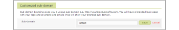

# Configure a branded domain in `Workfront Proof`

>[!IMPORTANT]
>
>This article refers to functionality in the standalone product `Workfront Proof`. For information on proofing inside `Adobe Workfront`, see [Proofing](../../../review-and-approve-work/proofing/proofing.md).

All `Workfront Proof` plans allow you to configure a branded sub-domain on your account. This means that you can customize your account URL to include your brand name.

For example, if you set your sub-domain to be kattest, your URL would look like this:

` [https://kattest.proofhq.com/dashboard](https://kattest.proofhq.com/dashboard)`

Setting a custom sub-domain also means that all links in your notification emails will include your customized sub-domain. For example: http://kattest.proofhq.com/proof/review/id/123456.

You can create a branded sub-domain or a fully branded domain.

## Configuring a Branded Sub-Domain

1. Log in to `Workfront Proof` as the `Workfront Proof administrator`.

1. Click `Account settings` in the upper-right corner of the `Workfront Proof` interface.

1. Click the `Settings` tab.
1. In the `Customized Sub-Domain` section, click `Setup`.

1. Enter your brand name. Do not enter the whole URL (e.g. www.kattest.com) only enter the brand name, e.g. kattest.
1. Click `Save`.

Only users with [Proof Permissions Profiles in Workfront Proof](../../../workfront-proof/wp-acct-admin/account-settings/proof-perm-profiles-in-wp.md) or&nbsp; [Proof Permissions Profiles in Workfront Proof](../../../workfront-proof/wp-acct-admin/account-settings/proof-perm-profiles-in-wp.md) rights can set up a branded sub-domain.

(Please see [Proof Permissions Profiles in Workfront Proof](../../../workfront-proof/wp-acct-admin/account-settings/proof-perm-profiles-in-wp.md) for reference.)

>[!NOTE]
>
>Once you have set up your sub-domain it will not be editable. If you wish to change it please contact `Workfront Proof` Support.

## Configuring a Fully Branded Domain

You can have a fully customized domain. For example, http:// `proofing`.<yourbrand>.com.

To set up your custom domain or branding, you must complete the following steps:

<ol> 
 <li value="1">As a first step, it is important to determine what type of SSL certificate is required for your white label URL:
  <ul>
   <li>If you plan to have only one Workfront Proof account, a standard SSL certificate with Single domain should be purchased.</li>
   <li>If you plan on having multiple Workfront Proof account (e.g., Satellite accounts), a Wildcard SSL certificate should be purchased. For general information about SSL certificates, see <a href="#understanding-certificate-signing-requests-and-ssl-certificates" class="MCXref xref">Understanding Certificate Signing Requests (CSR) and SSL Certificates</a>.</li>
  </ul></li> 
 <li value="2">A Certificate Signing Request (CSR) must be created by Workfront Proof. For general information about CSRs, see <a href="#understanding-certificate-signing-requests-and-ssl-certificates" class="MCXref xref">Understanding Certificate Signing Requests (CSR) and SSL Certificates</a>. In order for us to create the CSR, we need the following information: <note type="important">
    The CSR cannot be modified after it is generated. Ensure that the following information is correct.&nbsp;
  </note>
  <ul>
   <li>Common Name/Fully Qualified Domain Name (Everything after http://. This must match exactly what you type in your browser, e.g. www.yourdomain.com or proofing.yourdomain.com.</li>
   <li>Will you be using this domain for multiple Workfront Proof accounts? If you require multiple Workfront Proof accounts to use this domain, please specify this using the wildcard e.g., *.yourdomain.com.)</li>
   <li>Organization Name (Legal name of your Organization. This must not be abbreviated or include any suffixes e.g. Corp., Inc., Ltd.)</li>
   <li>Organizational Unit (The department in your organisation handling the Certificate. This could be "IT" or even "General".)</li>
   <li>City (City where your organization is located)</li>
   <li>State (State where your organization is located)</li>
   <li>Country code (2-letter ISO code for the country where your organization is located, e.g., US, GB.)</li>
  </ul></li> 
 <li value="3">After the information in step 2 is received, we create the CSR and send it to you along with the CNAME URL&nbsp;to point the domain to.</li> 
 <li value="4"> 
Give the CSR to a SSL Certificate Provider (Certificate Authority) who will create the SSL Certificate and Key chain for you.
 </li> 
 <li value="5"> 
Point the domain to the CNAME URL we provided (see step 3 above).
 </li> 
 <li value="6"> 
Send the SSL Certificate and Key chain to Workfront Proof.
 </li> 
</ol>

## Understanding Certificate Signing Requests (CSR) and SSL Certificates

### A Certificate Signing Request (CSR)

A CSR&nbsp;is a block of encrypted text that is generated on the server that the certificate will be used on. It contains information that will be included in your certificate, e.g. common name, organization name, as above. It also contains the public key that will be included in your certificate. (A private key is normally created at the same time.)

### SSL Certificate

SSL stands for Secure Sockets Layer Certificate. This provides a means by which your identity can be proven to web browsers, allowing a secure site to communicate privately with the you.

The type of SSL Certificate required is a standard SSL Certificate with a Single domain is all that is required. A multi-year SSL certificate is best, as this will prevent you from having to go through this process again in 12 months, but a single year SSL certificate is also fine.

When the SSL Certificate Provider creates the SSL Certificate, they will also provide you with the Key chain. The Key Chain allows web browsers to recognize your SSL certificate as a trusted certificate.
