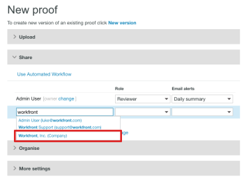

# Share items with a partner in *`Workfront Proof`* {#share-items-with-a-partner-in-workfront-proof}

>[!IMPORTANT] {type="important"}
>
>This article refers to functionality in the standalone product *`Workfront Proof`*. For information on proofing inside *`Adobe Workfront`*, see [Proofing](_proofing.md).

If you have a *`Workfront Proof`* partner relationship with another organization (such as a client or another department in your company), you can share *`proofs`*, files, folders, and contact details with the partner. For more information about partner relationships, see [Manage a partner relationship between Workfront Proof accounts](manage-partner-relationship-between-wp-accts.md).

## About Sharing Items with a Partner {#about-sharing-items-with-a-partner}

Consider the following when sharing items with a partner:

* You can choose a user in a partner account to be the owner of a *`proof`* only if it is new *`proof`* you are creating. You cannot do so for existing *`proof`* or a new version of a *`proof`*.

* When you share at item with a partner, you pass the editing rights for the *`proof`* to the Supervisors and Administrators in the partner account. Supervisors and Administrators in the account in which the *`proof`* was created no longer have edit rights on the *`proof`* (this includes the *`proof`* creator). For more information about permissions in *`Workfront Proof`*, see [Proof Permissions Profiles in Workfront Proof](proof-perm-profiles-in-wp.md).

* The *`proof`* is stored in the account where the *`proof`* is owned (not the account where it was created).

* The *`proof`* branding is taken from the account where the *`proof`* is owned (not the account where the *`proof`* was created).

## Sharing Items with a Partner {#sharing-items-with-a-partner}

After you have an accepted relationship with a partner, you can easily share items, such as folders, files, and *`proofs`* with them.

1. Begin sharing a *`proof`* or file.  
   For more information about sharing, see [Share a Proof in Workfront Proof](share-proof.md)&nbsp; [Share Files in Workfront Proof](share-files.md) and [Share Folders in Workfront Proof](share-folders.md).

1. In the `Share` section of the New&nbsp;Proof or New File page, the name of your partner appears as you begin typing the name in the auto-complete field, just as if you are sharing with another user in the system.  
   

## Making a User in a Partner Account the Proof Owner {#making-a-user-in-a-partner-account-the-proof-owner}

If you have set up Partner relationships with other *`Workfront Proof`* accounts, you can select a user from a Partner account to be the owner of your *`proof`*.

>[!NOTE]
>
>You can select a user from a Partner account only if the following conditions are met: 
>
>
>
>* There are no custom fields 
>* No folder has been selected 
>* No tags have been applied 
>
>

To make a user in a partner account the owner of a *`proof`*:

1. On the New Proof page, click the `Change`&nbsp;link. (1)  
   

1. Choose a user from a Partner account to be the owner of the *`proof`*. (2)  
   

