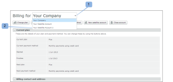

# Choosing Your Payment Method in `Workfront Proof`

>[!IMPORTANT]
>
>This article refers to functionality in the standalone product `Workfront Proof`. For information on proofing inside `Adobe Workfront`, see [Proofing](../../../review-and-approve-work/proofing/proofing.md).

## Understanding payment options

The following payment options are available:

| `Monthly subscriptions`  | `Annual subscriptions`  |
|---|---|
| credit card |credit card |
| bank transfer |

We do not accept checks

## Changing your payment method and credit&nbsp;card details

>[!NOTE]
>
>Consider the following before changing your payment method: 
>
>* The payment method change is not applied to your current subscription. If you&nbsp;want to change this for an invoice that has already been issued, please contact our Finance team at [finance@proofhq.com](mailto:finance@proofhq.com). 
>* You cannot change your payment method or add a Credit Card if a trial plan is set on your account. You will be able to set these&nbsp;details when upgrading your account. 
>

To change your next payment method and update your credit card details:

<ol> 
 <li value="1">Click Change payment details (1) at the top of the page Or Click&nbsp;Next payment method.&nbsp;(2) </li> 
 <li value="2">In the&nbsp;Change payment details&nbsp;pop-up, select your next payment method. (3)</li> 
 <li value="3">(Conditional)&nbsp;For the Credit Card payments, enter your card details. If you want to change your credit card details only, populate only the credit card details (4) fields with your new card data and save (5) the changes.&nbsp;You can change your credit card details at any time. The new&nbsp;card&nbsp;is used for all subscription payments effective immediately. We accept Visa, American Express and MasterCard.</li> 
 <li value="4">Click Save. (4) </li> 
</ol>

## Changing payment method&nbsp;details for Satellite accounts

If you have Satellite accounts, you need to update your credit card details and payment method separately for each account. For more information about Satellite accounts, see&nbsp; [Satellite accounts.](https://support.workfront.com/hc/en-us/sections/115000921108-Satellite-accounts)

<ol> 
 <li value="1">Go to the Billing page in your Hub account.  For more information about the Billing page, see <a href="../../../workfront-proof/wp-billingsettings/manage-your-billing/wp-billing-page.md" class="MCXref xref">The Workfront Proof Billing Page</a>.</li> 
 <li value="2">Open the accounts list drop-down menu. (1)</li> 
 <li value="3">Choose the satellite account (2) that is associated with the credit card you want to update.</li> 
 <li value="4">Continue with <a href="#change-your-payment-method-and-credit-card-details" class="MCXref xref">Changing your payment method and credit&nbsp;card details</a>. </li> 
</ol>

