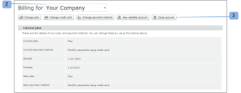

# Close your *Workfront Proof* account

>[!IMPORTANT]
>
>This article refers to functionality in the standalone product *Workfront Proof*. For information on proofing inside *Adobe Workfront*, see [Proofing](../../../review-and-approve-work/proofing/proofing.md).

&nbsp;After completing the steps in this section, your account will be closed immediately. All data in your account will be deleted and cannot be restored.

We are continuously trying to improve our product. If you do wish to close your account, we would be grateful if you could take a few minutes and let us know how we can improve.

You can contact us at support@proofhq.com with your comments; all feedback is welcome.

<ol> 
 <li value="1"> 
Open the Billing page in your account by opening the Settings menu and choosing Billing (1). 
 
For more information about the Billing page, see <a href="../../../workfront-proof/wp-billingsettings/manage-your-billing/wp-billing-page.md" class="MCXref xref">The Workfront Proof Billing Page</a>. 
 
  
 </li> 
 <li value="2"> 
Click the Close account button (3). 
 
  
 </li> 
 <li value="3">Select your reason for closing the account. (4)</li> 
 <li value="4"> 
Confirm your decision by clicking Save. (5) 
 
  
 </li> 
 <li value="5"> 
Enter your password to close your account. (6) 
 
  
 </li> 
</ol>

