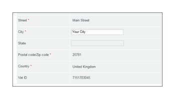
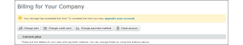
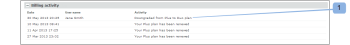
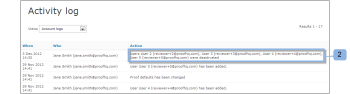

# The *Workfront Proof* Billing Page

>[!IMPORTANT]
>
>This article refers to functionality in the standalone product *Workfront Proof*. For information on proofing inside *Adobe Workfront*, see [Proofing](../../../review-and-approve-work/proofing/proofing.md).

## The Billing Page

To access the Billing page, open the `Settings` menu it the top right of the screen and choose `Billing` in the drop-down menu.

The Billing page contains the following:

<ul> 
 <li>Account name (1)</li> 
 <li>Accounts list (e.g. if you have Satellite accounts)(2)</li> 
 <li>Change plan (3)</li> 
 <li>Change payment details (4)</li> 
 <li>New satellite account (5)</li> 
 <li>Close account (6)</li> 
 <li>Current plan information (7)</li> 
 <li>Billing contact and address (8)</li> 
 <li>Usage statistics (9)</li> 
 <li>Billing history (10)</li> 
 <li> 
Billing activity (11)
 
  
 </li> 
</ul>

## Current Plan

This section (7) shows the details of your current plan, including the following:

* The name of the plan
* Current payment method
* Current plan start and finish dates
* Next plan type
* Next plan payment method

  For more information, see [Choosing Your Payment Method in Workfront Proof](../../../workfront-proof/wp-billingsettings/manage-your-billing/choose-payment-method-in-wp.md).

## Billing Contact and Address

This section (8) shows the main billing contact and address details for your account.

The Billing contact can be selected only from the users set up as the Billing Administrators on your account. On the Satellite accounts, only the Billing Administrators from the main account can be set in this field.

>[!NOTE]
>
>&nbsp;You can have multiple Billing Administrators on your account, but only one of them, selected in the Billing contact field, will be receiving all the billing notifications and account usage alerts. For more information, see [The Workfront Proof Billing Page](#).

This includes the following notification emails:

<ul> 
 <li>Proof usage</li> 
 <li>Invoices</li> 
 <li>Downgrade</li> 
 <li>Late payment/Account suspension alert</li> 
 <li> 
Credit card failure
 
  
 </li> 
</ul>

The Billing CC field also allows you to add an email address to be copied on all billing-related emails. Click on the filed to activate incline editing and enter an email address of your choice (this can be an existing user's email address too).

## Billing Address

This section&nbsp;uses inline editing so simply click on the fields to enter/edit&nbsp;the text.

>[!NOTE]
>
>&nbsp;We include this address on&nbsp;your subscription invoices so make sure this data is always&nbsp;up-to-date.

 

## Usage Statistics

This section shows the usage statistics for your account within the current billing period, including the following:

* Storage used
* Proofs used
* Users limit used

 

### Usage Warnings

The [Proof Permissions Profiles in Workfront Proof](../../../workfront-proof/wp-acct-admin/account-settings/proof-perm-profiles-in-wp.md) set as the Billing Contact (1) on your account will be notified via email when your account reaches:

* 75% and then 98% of your storage capacity
* 75% and then 100% of your *proof* limit

Once the *proofs* or storage limits are reached you will also see the alerts at the top of the Billing page:

* For the *proofs* limit reached

&nbsp; 

* For the storage limit reached

>[!NOTE]
>
>Your *proof* count is used up when *proofs* are created in your account and cannot be restored by removing the *proofs*.

Storage space can be freed by deleting the *proofs* and files and emptying the Trash afterwards.

Please remember that if you need more *proofs*, storage, or users you can upgrade your account&nbsp;at any time; and it takes immediate effect.

## Billing History

This section shows the activity for any recent billing periods. You can also download your invoices from this section.

For more information, see " [Downloading Your Workfront Proof Invoice](../../../workfront-proof/wp-billingsettings/manage-your-billing/download-wp-invoice.md)."

## Billing Activity

This section shows recent changes to your billing set up, e.g., subscriptions, upgrades, downgrades, and renewals of your *Workfront Proof* Plan.

If you change your plan to one with a lower user limit (1), users exceeding the new limit will automatically be deactivated when the new plan starts. This activity will also be captured in your Account logs (2).

&nbsp; 

