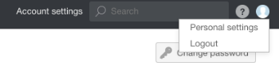
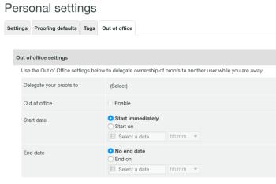
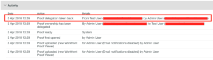

# Designating Temporary Proof Owners in Workfront Proof

>[!IMPORTANT]
>
>This article refers to functionality in the standalone product Workfront Proof. For information on proofing inside Adobe Workfront, see [Proofing](../../../review-and-approve-work/proofing/proofing.md).

If you are going to be out of the office for an extended period of time, you can delegate ownership of your proofs to another user in your account.&nbsp;

>[!NOTE]
>
>This function is available only in Workfront Proof.&nbsp;

To designate temporary ownership of your proofs:&nbsp;

<ol> 
 <li value="1">Within Workfront Proof, go to Personal settings. </li> 
 <li value="2">Click the Out of office tab.&nbsp;The following settings are available: 
  <ul>
   <li>Delegate your proofs to another user in your account.</li>
   <li>Enable and disable the Out of office function by checking or unchecking the checkbox.</li>
   <li>
Select the Start date. 

If the Start immediately option is chosen, ownership of the proofs will be delegated to the selected user immediately after you activate the feature.

If a specific start date and time are set, the feature will be activated on the selected day and at the chosen time.
</li>
  </ul>
  <ul>
   <li>
Select the End date. 

If no end date is chosen, the ownership of the proofs will be delegated until the feature is manually disabled.

If a specific end date and time are set, the feature will be disabled on the selected day and at the chosen time.

</li>
  </ul></li> 
 <li value="3"> 
When proofs are delegated, the delegated owner is shown in the Details section of the proof details page.&nbsp;The ownership delegation note appears in the Activity section of the proof details page.
 
  
 
An Out of Office notification is also shown in the original proof owner's account&nbsp;during the time the feature is enabled. This acts as a reminder to the original owner and also allows&nbsp;them to end the delegation immediately or go to Personal settings to adjust this.
 
  
 
When ownership of your proofs is taken back by the original owner, the delegated owner disappears from the Details section of the proof details page and the Out of Office notification is no longer displayed in the original proof owner's account. A note showing that proof ownership has been reverted appears in the Activity section of the proof details page. 
 <note type="note">
   The delegated owner remains on the proof workflow unless you manually remove them. 
  </note> 
  
 </li> 
</ol>

