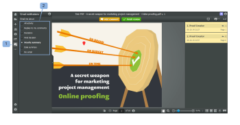
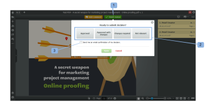

# Review and submit a decision in Workfront Proof - Reviewer's Guide

>[!IMPORTANT]
>
>This article refers to functionality in the standalone product Workfront Proof. For information on proofing inside Adobe Workfront, see [Proofing](../../../review-and-approve-work/proofing/proofing.md).

In this short instruction we present our new ProofHQ Viewer which highlights the benefits and new functionalities. You may still come across the proofs created in our Classic ProofHQ Viewer. If the proofs shared with you open in a viewer that looks different to the one presented here, check out our [Reviewer’s Guide for the Classic ProofHQ Viewer](http://www.proofhq.com/html/user-guide-for-reviewers.html).

## View the proof

It all starts with someone you know, who has a ProofHQ account and creates a proof from their file (i.e., design, document, project, video), and would like you to review and make a decision. You are notified about that with a “New proof” email. Opening a proof is as simple as opening an email and clicking on a link.

To start the proofing process:

1. Open the message in your inbox
1. Click the blue "Go to proof" button

The `Go to proof` button launches your default web browser and it will take you to the proof. The interface you see is called the ProofHQ Viewer and the proof awaiting your review will be displayed inside.

## Add comments and markups

You can navigate through the proof pages using the tools (1) at the bottom of the ProofHQ Viewer.

If you want to add a comment to the proof, or to mark-up an area of the proof:

<ol> 
 <li value="1"> 
Click the orange Add Comment button (2)
 
  
 </li> 
 <li value="2">Type your comment into the comments box (3)</li> 
 <li value="3">Add one or more markups (4) to highlight the area of the proof referring to - you have a variety of tools (4) to choose from.</li> 
 
Use the rectangle tool to draw a simple box shape. Pencil (freehand tool) is great for more precise and complex selections. Use the line tool to draw straight lines or polyline to create various shapes. Add arrows to call something out or indicate a piece of text. The marker tool can be a great highlighter and with the crop tool you can indicate a trim area. Change markups color, thickness, or delete markups.
 
 
  
 
 <li value="4">Click Save (5) when you are finished</li> 
</ol>

As soon as you save your comment a new comment box will activate so you can continue your work without any additional clicks.

>[!TIP]
>
>While in the commenting mode use the “Shift” and the “Space bar” keys to switch between Pan and Zoom mode.

`Annotating text`

If you are reviewing a proof that contains text that is selectable, then you will see the text annotation tool (6) activated in the markups toolbar.

You can correct a text or make some comment markup:

<ol> 
 <li value="1">Activate the text tool (6)</li> 
 <li value="2">Highlight a part of a text on the proof (7) - your selection will be placed into the active comment box (8)</li> 
 <li value="3">Select one of the annotation options (9)</li> 
 <li value="4">Add your own comment text inside the box</li> 
 <li value="5">Save your comment.</li> 
  
</ol>

>[!NOTE]
>
>&nbsp;When the annotation tool is active, all the other markups are deactivated.

>[!TIP]
>
>All collaborators can access the proof and make their comments at the same time. These comments will appear in your ProofHQ Viewer in real time and will allow you to have a live, dynamic discussion on the project.

## Read and reply to comments

You might open the proof and find that other collaborators have already made their comments. You will see the list of comments on the right hand side of the viewer.

To view these comments and respond:

1. In the comment list, click on the comment you wish to view (1).
1. Click and type in the text field (2) of the comment box to reply to a comment.
1. Click `Save`.

>[!TIP]
>
>You can change how comments are displayed (e.g., a list or a single comment view), and you can filter them using the tools (4) available in the top right corner of the ProofHQ Viewer

## Email alerts on the proofs

When a proof is created, the proof creator sets your [Configure email notification settings in Workfront Proof](../../../workfront-proof/wp-emailsntfctns/email-alerts/config-email-notification-settings-wp.md) so you can be notified of all the new actions made on the proof. Every new comment and decision made on a proof can generate an email notification that will be delivered to your inbox. If you feel that you’re receiving too many notifications or you’d like to receive these emails more frequently you can easily modify your email alert frequency on each of the proofs shared with you. To change your email alert on a proof:

* Open the ProofHQ Viewer sidebar and select the email notifications icon
* Select a new email alert type of your choice

>[!TIP]
>
>Your preferable email notifications can be saved in our system. Get in touch with the proof creator so they could set this up for you and apply on every new proof shared with you.

## Submit your decision

When you finished creating comments and mark-ups, it is time to submit your decision:

1. Click on the green "Finish review" (1) button.
1. In the decision pop-up (2) select an option of your choice

>[!NOTE]
>
>If you want to receive an email confirmation of your decision, check the confirmation box (3) before saving your decision.

