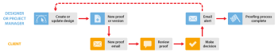

# Basic Proofing Process in *`Workfront Proof`* {#basic-proofing-process-in-workfront-proof}

>[!IMPORTANT] {type="important"}
>
>This article refers to functionality in the standalone product *`Workfront Proof`*. For information on proofing inside *`Adobe Workfront`*, see [Proofing](_proofing.md).

This example explains the basic workflow between a designer or project manager and one or more reviewers, such as a client.

* `Create new *`proof`*` - The designer or project manager creates a new *`proof`* in *`Workfront Proof`* and shares the *`proof`* with the client. (See [Generate Proofs in Workfront Proof](generate-proofs.md).)

* `New *`proof`* email` - The client receives an email containing a link to the *`proof`*.

* `Review a *`proof`*` - The client reviews the *`proof`*, adds comments and makes a decision. (See [Review proofs within Adobe Workfront](_review-proofs-in-wf.md) and [Make decisions on a proof](make-decisions-on-proof.md).)

* `Email alert`&nbsp;- the designer or project manager receives an email with a summary of the client's review, depending on the email&nbsp;alerts they have set. (See [Configure email notification settings in Workfront Proof](config-email-notification-settings-wp.md).)

* `New version` (if required) - The designer or project manager amends the file and uploads it to *`Workfront Proof`* as a new version. (See .)

You can repeat this process until the *`proof`* is approved. 
